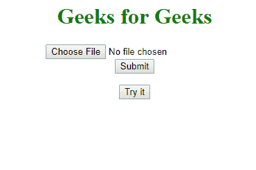
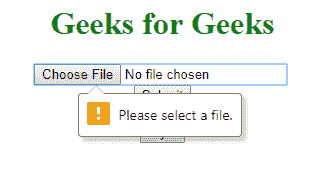
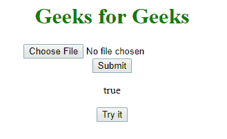
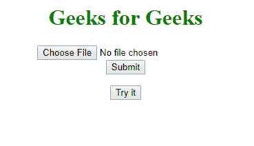
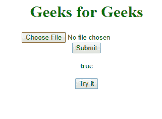

# HTML | DOM 输入文件上传所需属性

> 原文:[https://www . geesforgeks . org/html-DOM-input-file upload-required-property/](https://www.geeksforgeeks.org/html-dom-input-fileupload-required-property/)

**输入文件上传所需属性**用于**设置**或**返回**是否在提交表单之前必须选择/上传文件上传字段中的文件。
该属性反映了 HTML 必需属性。

**语法:**

*   **返回所需属性:**

    ```html
    fileuploadObject.required
    ```

*   **设置所需属性:**

    ```html
    fileuploadObject.required=true|false
    ```

**属性值:**
**真:**需要文件上传字段时返回*【真】*。
**假:**不需要文件上传字段时返回*‘假’*。

**返回值:** **显示文件上传状态的布尔值必填字段。**

**示例-1:** 返回文件上传所需属性。

```html
<!DOCTYPE html>
<html>

<head>
    <title>
      Input FileUpload required Property
  </title>
    <style>
        h1 {
            color: green;
        }
    </style>
</head>

<body>
    <center>
        <h1>
          Geeks for Geeks
      </h1>
        <form action="/action_page.php">
            <input type="file"
                   id="myFile"
                   required>
            <br>
            <input type="submit" 
                   value="Submit">
        </form>

        <p id="demo"></p>

        <button onclick="myFunction()">
          Try it
      </button>

        <script>
            function myFunction() {
                var x = 
                    document.getElementById(
                      "myFile").required;
                document.getElementById("demo").innerHTML = x;
            }
        </script>
    </center>
</body>

</html>
```

**输出:**
**前:**

**后:**




**示例-2:** 设置文件上传所需属性

```html
<!DOCTYPE html>
<html>

<head>
    <title>
      Input FileUpload required Property
  </title>
    <style>
        h1 {
            color: green;
        }
    </style>
</head>

<body>
    <center>
        <h1>
          Geeks for Geeks
      </h1>
        <form action="/action_page.php">
            <input type="file"
                   id="myFile">
            <br>
            <input type="submit" 
                   value="Submit">
        </form>

        <p id="demo"></p>

        <button onclick="myFunction()">
          Try it
      </button>

        <script>
            function myFunction() {
                var x =
                    document.getElementById(
                      "myFile").required = "true";

                document.getElementById("demo").innerHTML = x;
            }
        </script>
    </center>
</body>

</html>
```

**输出:**
**前:**

**后:**

**支持的浏览器:**

*   谷歌 Chrome
*   Mozilla Firefox
*   Edge 10.0
*   歌剧
*   苹果 Safari