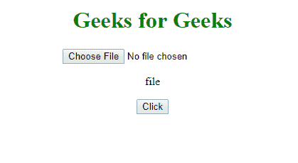

# HTML | DOM 输入文件上传类型属性

> 原文:[https://www . geesforgeks . org/html-DOM-input-file upload-type-property/](https://www.geeksforgeeks.org/html-dom-input-fileupload-type-property/)

**输入文件上传类型属性**在 HTML DOM 中用于**返回** *文件上传按钮的表单元素类型为*。此属性将始终为文件上传按钮返回“文件”。

**语法:**

```html
fileuploadObject.type
```

**返回值:**返回一个字符串值，代表文件上传按钮的表单元素类型。
**例:**

## 超文本标记语言

```html
<!DOCTYPE html>
<html>

<head>
    <style>
        h1 {
            color: green;
        }
    </style>
</head>

<body>
    <center>
        <h1>
          Geeks for Geeks
      </h1>
        <input type="file"
               id="myFile"
               required>

        <p id="demo"></p>

        <button onclick="myFunction()">
          Click
      </button>

        <script>
            function myFunction() {
                var x =
                    document.getElementById(
                      "myFile").type;

                document.getElementById(
                  "demo").innerHTML = x;
            }
        </script>
    </center>
</body>

</html>
```

**输出:**
**前:**


**之后:**



**支持的浏览器:**

*   谷歌 Chrome
*   Mozilla Firefox
*   Edge 10.0
*   歌剧
*   苹果 Safari