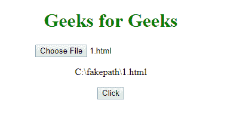

# HTML | DOM 输入文件上传值属性

> 原文:[https://www . geesforgeks . org/html-DOM-input-file upload-value-property/](https://www.geeksforgeeks.org/html-dom-input-fileupload-value-property/)

**输入文件上传值属性**用于**返回** *用元素*选择的文件路径或名称。
该属性用于在 IE、Google Chrome、Opera 中返回路径为假的选中文件的名称，在 Firefox、Safari 中返回选中文件的名称。出于安全原因，此属性是只读的。

**语法:**

```html
fileuploadObject.value
```

**示例:**返回**【路径】**。

```html
<!DOCTYPE html>
<html>

<head>
    <title>
        HTML DOM Input FileUpload value
    </title>
    <style>
        h1 {
            color: green;
        }
    </style>
</head>

<body>
    <center>
        <h1>
          Geeks for Geeks
      </h1>

        <input type="file" 
               id="myFile" 
               required>

        <p id="demo"></p>

        <button onclick="myFunction()">
            Click
        </button>

        <script>
            function myFunction() {
                var x =
                    document.getElementById(
                        "myFile").value;

                document.getElementById(
                    "demo").innerHTML = x;
            }
        </script>
    </center>
</body>

</html>
```

**输出:**
**点击按钮前:**


**点击按钮后:**


**支持的浏览器:**

*   谷歌 Chrome
*   Mozilla Firefox
*   Edge 10.0
*   歌剧
*   苹果 Safari