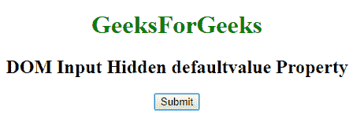
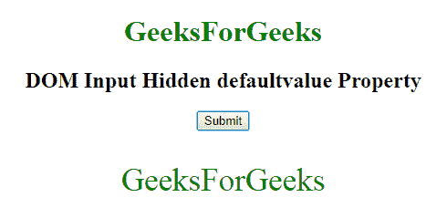
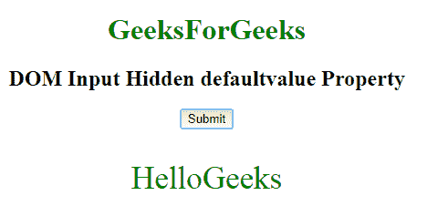

# HTML | DOM 输入隐藏默认值属性

> 原文:[https://www . geesforgeks . org/html-DOM-input-hidden-default value-property/](https://www.geeksforgeeks.org/html-dom-input-hidden-defaultvalue-property/)

HTML DOM 中的**输入隐藏默认值属性**用于设置或返回隐藏字段的默认值。此属性用于反映 HTML 值属性。默认值与值的主要区别在于，默认值表示默认值，值包含进行一些更改后的当前值。此属性对于确定日期字段是否已更改非常有用。

**语法:**

*   它返回 defaultValue 属性。

    ```html
    hiddenObject.defaultValue
    ```

*   它用于设置 defaultValue 属性。

    ```html
    hiddenObject.defaultValue = value
    ```

**属性值:**包含单个属性值**值**，定义输入隐藏字段的默认值。

**返回值:**返回一个字符串值，代表输入隐藏字段的默认值。

**示例 1:** 此示例说明如何返回 Input 隐藏的 defaultValue 属性。

```html
<!DOCTYPE html> 
<html> 

<head> 
    <title> 
        HTML Input Hidden defaultValue Property 
    </title> 
</head> 

<body style="text-align:center;"> 

    <h1 style="color:green;"> 
        GeeksForGeeks 
    </h1> 

    <h2>DOM Input Hidden defaultvalue Property</h2> 

    <input type="hidden" id="GFG"
                value="GeeksForGeeks"> 

    <button onclick="myGeeks()"> 
        Submit 
    </button> 

    <p id="sudo" style="color:green;font-size:35px;"></p> 

    <!-- Script to return the hidden value -->
    <script> 
        function myGeeks() { 
            var x = document.getElementById("GFG").defaultValue; 
            document.getElementById("sudo").innerHTML = x; 
        } 
    </script> 
</body> 

</html>
```

**输出:**

*   **点击按钮前:**
    
*   **点击按钮后:**
    

**示例 2:** 本示例说明如何设置 Input 隐藏的 defaultValue 属性。

```html
<!DOCTYPE html> 
<html> 

<head> 
    <title> 
        HTML Input Hidden defaultvalue Property 
    </title> 
</head> 

<body style="text-align:center;"> 

    <h1 style="color:green;"> 
        GeeksForGeeks 
    </h1> 

    <h2>DOM Input Hidden defaultvalue Property</h2> 

    <input type="hidden" id="GFG"
                value="GeeksForGeeks"> 

    <button onclick="myGeeks()"> 
        Submit 
    </button> 

    <p id="sudo" style="color:green;font-size:35px;"></p> 

    <!-- Script to return the hidden value -->
    <script> 
        function myGeeks() { 
            var x = document.getElementById("GFG").defaultValue
                         = "HelloGeeks";
            ; 
            document.getElementById("sudo").innerHTML = x; 
        } 
    </script> 
</body> 

</html>                     
```

**输出:**

*   **点击按钮前:**
    
*   **点击按钮后:**
    

**支持的浏览器:**T2 DOM 输入隐藏默认值属性支持的浏览器如下:

*   谷歌 Chrome
*   微软公司出品的 web 浏览器
*   火狐浏览器
*   苹果 Safari
*   歌剧