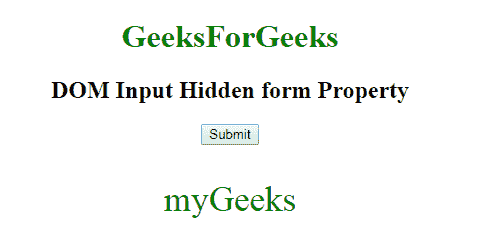

# HTML | DOM 输入隐藏表单属性

> 原文:[https://www . geesforgeks . org/html-DOM-input-hidden-form-property/](https://www.geeksforgeeks.org/html-dom-input-hidden-form-property/)

**输入隐藏表单属性**用于返回包含输入隐藏字段的表单的引用。成功时返回表单对象的是只读属性。
**语法:**

```html
hiddenObject.form
```

**返回值**:返回一个字符串值，指定包含输入隐藏字段的表单的引用

下面的程序说明了输入隐藏表单属性。
**例-1:**

## 超文本标记语言

```html
<!DOCTYPE html>
<html>

<body>
    <center>
        <h1 style="color:green;">
          GeeksForGeeks
      </h1>

        <h2>DOM Input Hidden form Property </h2>
        <form id="myGeeks">
            <input type="hidden"
                   id="GFG">
        </form>

        <button onclick="myGeeks()">
          Submit
      </button>

        <p id="sudo"
           style="color:green;font-size:35px;">
      </p>

        <script>
            function myGeeks() {
                var x =
                document.getElementById(
                  "GFG").form.id;
                document.getElementById(
                  "sudo").innerHTML = x;
            }
        </script>
  </center>

</body>

</html>
```

**输出:**
**点击按钮前:**


**点击按钮后:**



**支持的浏览器:**T2 DOM 输入隐藏表单属性支持的浏览器如下:

*   谷歌 Chrome
*   微软公司出品的 web 浏览器
*   火狐浏览器
*   歌剧
*   旅行队