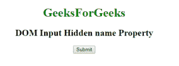
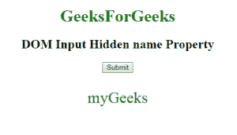
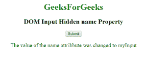

# HTML | DOM 输入隐藏名称属性

> 原文:[https://www . geesforgeks . org/html-DOM-input-hidden-name-property/](https://www.geeksforgeeks.org/html-dom-input-hidden-name-property/)

HTML DOM 中的**输入隐藏名称属性**用于设置或返回名称属性的值。已经提交给服务器的表单数据可以通过名称属性来识别。name 属性还用于在客户端使用 JavaScript 引用表单数据。

**语法:**

*   它返回输入隐藏名称属性。

    ```html
    hiddenObject.name
    ```

*   It is used to set the Input Hidden name property.

    ```html
    hiddenObject.name = name
    ```

    **属性值:**包含单值**名称**，用于指定隐藏输入字段的名称。

    **返回值:**返回一个代表隐藏输入字段名称的字符串值。

    **示例 1:** 本示例说明如何返回 Input Hidden name 属性。

    ```html
    <!DOCTYPE html>
    <html>

    <head>
        <title>
            HTML DOM Input Hidden name Property
        </title>
    </head>

    <body style="text-align:center;">

        <h1 style="color:green;">
            GeeksForGeeks 
        </h1>

        <h2>
            DOM Input Hidden name Property
        </h2>

        <input type="hidden" id="GFG" name ="myGeeks"
                value="GeeksForGeeks">

        <button onclick="myGeeks()">
            Submit
        </button>

        <p id="sudo" style="color:green;font-size:30px;"></p>

        <!-- Script to use Input Hidden name property -->
        <script>
            function myGeeks() {
                var x = document.getElementById("GFG").name;
                document.getElementById("sudo").innerHTML = x;
            }
        </script>

    </body>
    </html>                    
    ```

    **输出:**
    **点击按钮前:**
    
    **点击按钮后:**
    

    **示例 2:** 本示例说明如何设置输入隐藏名称属性。

    ```html
    <!DOCTYPE html>
    <html>

    <head>
        <title>
            HTML DOM Input Hidden name Property
        </title>
    </head>

    <body style="text-align:center;">

        <h1 style="color:green;">
            GeeksForGeeks 
        </h1>

        <h2>
            DOM Input Hidden name Property 
        </h2>

        <input type="hidden" id="GFG" name ="myGeeks"
                value="GeeksForGeeks">

        <button onclick="myGeeks()">
            Submit
        </button>

        <p id="sudo" style="color:green;font-size:20px;"></p>

        <!-- Script to use Input Hidden name Property -->
        <script>
            function myGeeks() {
                var x = document.getElementById("GFG").name 
                        = "myInput";

                document.getElementById("sudo").innerHTML
                        = "The value of the name attribbute "
                        + "was changed to " + x;
            }
        </script>
    </body>

    </html>                    
    ```

    **输出:**
    **点击按钮前:**
    
    **点击按钮后:**
    

    **支持的浏览器:**T2 DOM 输入隐藏名称属性支持的浏览器如下:

    *   谷歌 Chrome
    *   微软公司出品的 web 浏览器
    *   火狐浏览器
    *   歌剧
    *   旅行队