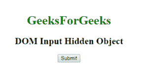
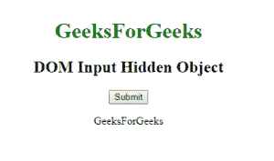
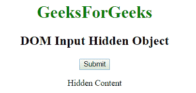

# HTML | DOM 输入隐藏对象

> 原文:[https://www.geeksforgeeks.org/html-dom-input-hidden-object/](https://www.geeksforgeeks.org/html-dom-input-hidden-object/)

HTML DOM 中的 Input Hidden 对象表示具有 type = "hidden "属性的<input>元素。可以使用 getElementById()方法访问该元素。

**语法:**

```html
document.getElementById("id"); 
```

其中 id 被分配给<input>标签。

**属性值:**

*   **默认值:**用于设置或返回隐藏输入字段的默认值。
*   **表单:**返回包含隐藏输入字段的表单的引用。
*   **名称:**用于设置或返回隐藏输入字段的名称属性值。
*   **类型:**返回隐藏输入字段所属的表单元素类型。
*   **值:**用于设置或返回隐藏输入字段的值属性的值。

**示例 1:** 本示例描述了使用 getElementById()方法访问具有 type = "hidden "属性的<输入>元素。

```html

<html> 
<head> 
<title> DOM Input Hidden Object </title> 
</head> 
<body> 
    <center>
        <h1 style = "color:green;">
            GeeksForGeeks
        </h1>

        <h2>DOM Input Hidden Object</h2>

        <input type = "hidden" id = "myGeeks"
                    value="GeeksForGeeks">

        <button onclick = "Geeks()">
            Submit
        </button>

        <p id = "sudo"></p>

        <script>
            function Geeks() {
                var g = document.getElementById("myGeeks").value; 
                document.getElementById("sudo").innerHTML = g; 
            }
        </script>
    </center>
</body>

</html>        

```

**输出:**
**点击按钮前:**

**点击按钮后:**


**示例 2:** 输入隐藏对象可以使用*文档.创建元素*方法创建。

```html
<!DOCTYPE html>
<html>

<head>
    <title>
        DOM Input Hidden Object
    </title>
</head>

<body>
    <center>
        <h1 style = "color:green;">
            GeeksForGeeks
        </h1>

        <h2>DOM Input Hidden Object</h2>

        <input type = "hidden" id = "myGeeks"
                    value="GeeksForGeeks">

        <button onclick = "Geeks()">
            Submit
        </button>

        <p id = "sudo"></p>

        <script>
            function Geeks() {
                var g = document.createElement("INPUT");
                g.setAttribute("type", "hidden");
                document.body.appendChild(g);

                document.getElementById("sudo").innerHTML
                        = "Hidden Content";
            }
        </script>
    </center>
</body>

</html>                    
```

**输出:**
**点击按钮前:**

**点击按钮后:**

**支持的浏览器:**DOM 输入隐藏对象支持的浏览器如下:

*   谷歌 Chrome
*   微软公司出品的 web 浏览器
*   火狐浏览器
*   歌剧
*   旅行队