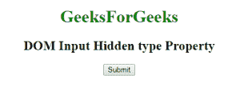
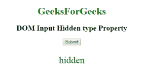

# HTML | DOM 输入隐藏类型属性

> 原文:[https://www . geesforgeks . org/html-DOM-input-hidden-type-property/](https://www.geeksforgeeks.org/html-dom-input-hidden-type-property/)

**DOM 输入隐藏类型属性**用于返回隐藏输入字段的表单元素类型。
输入隐藏类型返回一个字符串值，代表隐藏输入字段的表单元素类型。
**语法:**

```html
hiddenObject.type
```

**返回值:**它返回一个字符串值，该值定义了输入隐藏字段的表单元素类型。

下面的程序说明了输入隐藏类型属性:
**示例:**返回输入隐藏类型字段的表单元素类型。

## 超文本标记语言

```html
<!DOCTYPE html>
<html>

<body>
    <center>
        <h1 style="color:green;">GeeksForGeeks </h1>
        <h2>DOM Input Hidden type Property </H2>
        <form id="myGeeks">
            <input type="hidden" id="GFG"
                   name="myGeeks" value="GeeksForGeeks">
        </form>

        <button onclick="myGeeks()">Submit</button>

        <p id="sudo" style="color:green;font-size:30px;">
        </p>

        <script>
            function myGeeks() {
                var x = document.getElementById("GFG").type;
                document.getElementById("sudo").innerHTML = x;
            }
        </script>

</body>

</html>
```

**输出:**
**点击按钮前:**



**点击按钮后:**



**支持的浏览器:**T2 DOM 输入隐藏类型属性支持的浏览器如下:

*   谷歌 Chrome
*   微软公司出品的 web 浏览器
*   火狐浏览器
*   歌剧
*   旅行队