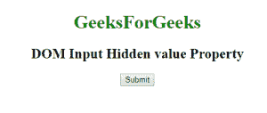

# HTML | DOM 输入隐藏值属性

> 原文:[https://www . geesforgeks . org/html-DOM-input-hidden-value-property/](https://www.geeksforgeeks.org/html-dom-input-hidden-value-property/)

HTML DOM 中的**输入隐藏值属性**用于设置或返回隐藏输入字段的值属性的值。value 属性定义了输入隐藏字段的默认值。
**语法:**

*   它返回 value 属性。

```html
hiddenObject.value
```

*   它用于设置 value 属性。

```html
hiddenObject.value = text
```

**属性值:**该属性包含单值**文本**，用于指定输入隐藏字段的初始值。
**返回值:**返回一个字符串值，代表隐藏输入字段的值属性的值。
**例 1:** 这个例子说明了如何返回隐藏属性值。

## 超文本标记语言

```html
<!DOCTYPE html>
<html>

<head>
    <title>
        HTML DOM Input Hidden value Property
    </title>
</head> 

<body style="text-align:center;">

    <h1 style="color:green;">
        GeeksForGeeks
    </h1>

    <h2>DOM Input Hidden value Property</h2>

    <input type="hidden" id="GFG"
                value="GeeksForGeeks">

    <button onclick="myGeeks()">
        Submit
    </button>

    <p id="sudo" style="color:green;font-size:35px;"></p>

    <!-- Script to return the hidden value -->
    <script>
        function myGeeks() {
            var x = document.getElementById("GFG").value;
            document.getElementById("sudo").innerHTML = x;
        }
    </script>
</body>

</html>                   
```

**输出:**
**点击按钮前:**



**点击按钮后:**


**示例 2:** 本示例说明如何设置隐藏属性。

## 超文本标记语言

```html
<!DOCTYPE html>
<html>

<head>
    <title>
        HTML Input Hidden value Property
    </title>
</head> 

<body style="text-align:center;">

    <h1 style="color:green;">
        GeeksForGeeks
    </h1>

    <h2>DOM Input Hidden value Property</h2>

    <input type="hidden" id="GFG" value="GeeksForGeeks">

    <button onclick="myGeeks()">
        Submit
    </button>

    <p id="sudo" style="color:green;font-size:20px;"></p>

    <!-- Script to set hidden property value -->
    <script>
        function myGeeks() {
            var x = document.getElementById("GFG").value
                    = "Sudo Placement";
            document.getElementById("sudo").innerHTML
                    = "The value of the value attribute"
                    + " have changed to " + x;
        }
    </script>
</body>

</html>                   
```

**输出:**
**点击按钮前:**


**点击按钮后:**


**支持的浏览器:**T2 DOM 输入隐藏值属性支持的浏览器如下:

*   谷歌 Chrome
*   微软公司出品的 web 浏览器
*   火狐浏览器
*   歌剧
*   旅行队