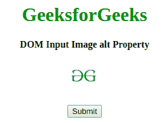
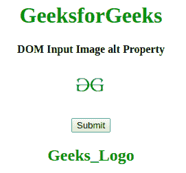
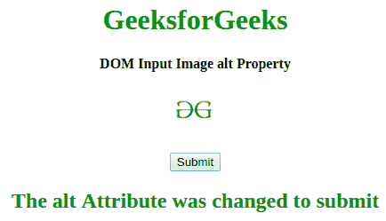

# HTML | DOM 输入图像 alt 属性

> 原文:[https://www . geesforgeks . org/html-DOM-input-image-alt-property/](https://www.geeksforgeeks.org/html-dom-input-image-alt-property/)

**HTML DOM 输入图像 alt 属性**用于设置或返回输入图像的 **alt** 属性的值。 **alt** 属性用于指定图像的替代文本。当图像不显示时，这很有用。它用于为图像提供替代信息。

**语法:**

*   它返回 alt 属性。

    ```html
    imageObject.alt 
    ```

    *   It is used to Set the alt property.

    ```html
    imageObject.alt = text 
    ```

    **属性值:**它包含为输入图像指定替代文本的值，即**文本**。

    **返回值:**返回一个字符串值，代表输入图像的可选文本。

    **示例 1:** 本示例返回 alt 属性。

    ```html
    <!DOCTYPE html>
    <html>

    <head>
        <title>
            HTML DOM Input Image alt Property
        </title>
    </head>

    <body style="text-align:center;">

        <h1 style="color:green;"> 
          GeeksforGeeks 
        </h1>

        <h4>
          DOM Input Image alt Property
        </h4>
        <input id="myImage" formEnctype="application/x-www-form-urlencoded" 
               type="image" formtarget="#" src=
    "https://media.geeksforgeeks.org/wp-content/uploads/gfg-40.png" 
               alt="Geeks_Logo" width="48" height="48" formMethod="post" 
               autofocus>
        <br>
        <br>
        <button onclick="my_geek()">Submit </button>

        <h2 id="Geek_h" style="color:green;"></h2>
        <script>
            function my_geek() {

                // set Disabled Property. 
                var txt = document.getElementById(
                    "myImage").alt;
                document.getElementById(
                    "Geek_h").innerHTML = txt;
            }
        </script>
    </body>

    </html>
    ```

    **输出:**

    *   点击按钮前:
        
    *   点击按钮后:
        

    **示例 2:** 本示例设置 alt 属性。

    ```html
    <!DOCTYPE html>
    <html>

    <head>
        <title>
            HTML DOM Input Image alt Property
        </title>
    </head>

    <body style="text-align:center;">

        <h1 style="color:green;"> 
          GeeksforGeeks 
        </h1>

        <h4>
          DOM Input Image alt Property
        </h4>
        <input id="myImage" formEnctype="application/x-www-form-urlencoded" 
               type="image" formtarget="#" src=
    "https://media.geeksforgeeks.org/wp-content/uploads/gfg-40.png" 
               alt="Geeks_Logo" width="48" height="48" formMethod="post"
               autofocus>
        <br>
        <br>
        <button onclick="my_geek()">Submit </button>

        <h2 id="Geek_h" style="color:green;"> 

            </h2>
        <script>
            function my_geek() {

                // set Disabled Property. 
                var txt = document.getElementById(
                    "myImage").alt = "submit";
                document.getElementById(
                        "Geek_h").innerHTML =
                    "The alt Attribute was changed to " + txt;
            }
        </script>
    </body>

    </html>
    ```

    **输出:**

    *   点击按钮前:
        
    *   点击按钮后:
        

    **支持的浏览器:***HTML DOM 输入图片 alt 属性*支持的浏览器如下:

    *   google chrome 10.0
    *   Firefox 4.0
    *   Opera 11.0
    *   Safari 5.1