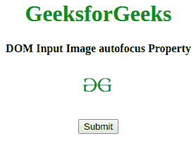
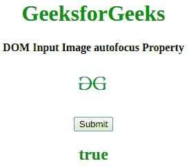
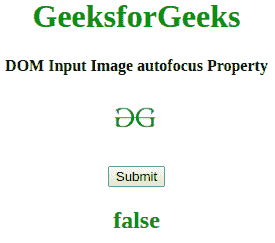

# HTML | DOM 输入图像自动对焦属性

> 原文:[https://www . geesforgeks . org/html-DOM-input-image-autofocus-property/](https://www.geeksforgeeks.org/html-dom-input-image-autofocus-property/)

**HTML DOM 输入图像自动对焦属性**用于设置或返回页面加载时输入图像字段是否应该对焦。它反映了 HTML 自动对焦属性。

**语法:**

*   它返回自动对焦属性。

    ```html
    imageObject.autofocus
    ```

*   它用于设置自动对焦属性。

    ```html
    imageObject.autofocus = "true|false"
    ```

**属性值:**

*   **true:** 设置输入图像的焦点。
*   **false:** 为默认值。它定义了输入图像字段不能获得焦点。

**返回值:**返回代表图像场是否自动对焦的布尔值。

**示例 1:** 本示例设置输入图像自动对焦属性。

```html
<!DOCTYPE html>
<html>

<head>
    <title>
        HTML DOM Input Image autofocus Property
    </title>
</head>

<body style="text-align:center;">

    <h1 style="color:green;"> 
      GeeksforGeeks 
    </h1>

    <h4>
      DOM Input Image autofocus Property
    </h4>
    <input id="myImage" formEnctype="application/x-www-form-urlencoded"
           type="image" formtarget="#" src=
"https://media.geeksforgeeks.org/wp-content/uploads/gfg-40.png" 
           alt="Submit" width="48" height="48" formMethod="post" 
           autofocus>
    <br>
    <br>
    <button onclick="my_geek()">Submit </button>

    <h2 id="Geek_h" style="color:green;"> 

        </h2>
    <script>
        function my_geek() {

            // set Disabled Property. 
            var txt = document.getElementById(
                "myImage").autofocus;
            document.getElementById(
                "Geek_h").innerHTML = txt;
        }
    </script>
</body>

</html>
```

**输出:**

*   点击按钮前:
    
*   点击按钮后:
    

**示例 2:** 本示例返回输入图像自动对焦属性。

```html
<!DOCTYPE html>
<html>

<head>
    <title>
        HTML DOM Input Image autofocus Property
    </title>
</head>

<body style="text-align:center;">

    <h1 style="color:green;"> 
            GeeksforGeeks 
   </h1>

    <h4>DOM Input Image autofocus Property</h4>
    <input id="myImage" formEnctype="application/x-www-form-urlencoded"
           type="image" formtarget="#" src=
"https://media.geeksforgeeks.org/wp-content/uploads/gfg-40.png" 
           alt="Submit" width="48" height="48" formMethod="post"
           autofocus>
    <br>
    <br>
    <button onclick="my_geek()">Submit </button>

    <h2 id="Geek_h" style="color:green;"> 

        </h2>
    <script>
        function my_geek() {

            // set Disabled Property. 
            var txt = document.getElementById(
                "myImage").autofocus = false;
            document.getElementById(
                "Geek_h").innerHTML = txt;
        }
    </script>
</body>

</html>
```

**输出:**

*   点击按钮前:
    
*   点击按钮后:
    

**支持的浏览器:***HTML DOM 输入图像自动对焦属性*支持的浏览器如下:

*   google chrome 10.0
*   Firefox 4.0
*   Opera 11.0
*   Safari 5.1