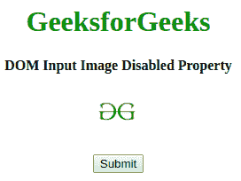
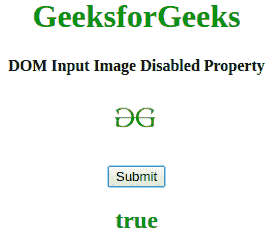
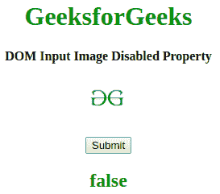

# HTML | DOM 输入图像禁用属性

> 原文:[https://www . geesforgeks . org/html-DOM-input-image-disabled-property/](https://www.geeksforgeeks.org/html-dom-input-image-disabled-property/)

**HTML DOM 输入图像禁用属性**用于设置或返回表示图像字段是否应禁用的布尔值。默认情况下，禁用的元素以灰色显示，不可用且不可拾取。

**语法:**

*   它返回禁用的属性。

    ```html
    imageObject.disabled
    ```

*   它用于设置禁用属性。

    ```html
    imageObject.disabled = true|false
    ```

**属性值:**该属性接受上面提到的和下面描述的两个参数:

*   **true:** 指定禁用图像字段。
*   **false:** 指定图像字段未禁用。

**返回值:**返回一个布尔值，即图像字段禁用时为真，图像字段未禁用时为假。

**示例 1:** 本示例返回禁用的值

```html
<!DOCTYPE html>
<html>

<head>
    <title>
        HTML DOM Input Image Disabled property
    </title>
</head>

<body style="text-align:center;">

    <h1 style="color:green;"> 
      GeeksforGeeks 
    </h1> 
    <h4>
      DOM Input Image Disabled Property
    </h4>
    <input id="myImage" formEnctype="application/x-www-form-urlencoded" 
           type="image" formtarget="#" src=
"https://media.geeksforgeeks.org/wp-content/uploads/gfg-40.png" 
           alt="Submit" width="48" height="48" formMethod="post"
           disabled>
    <br>
    <br>
    <button onclick="my_geek()">Submit </button>

    <h2 id="Geek_h" style="color:green;"></h2>
    <script>
        function my_geek() {

            // Return target, alt and height. 
            var txt = document.getElementById(
                "myImage").disabled;
            document.getElementById(
                "Geek_h").innerHTML = txt;
        }
    </script>
</body>

</html>
```

**输出:**

*   点击按钮前:
    
*   点击按钮后:
    

**示例 2:** 本示例设置禁用属性的值。

```html
<!DOCTYPE html>
<html>

<head>
    <title>
        HTML DOM Input Image Disabled property
    </title>
</head>

<body style="text-align:center;">

    <h1 style="color:green;"> 
      GeeksforGeeks 
    </h1>

    <h4>
      DOM Input Image Disabled Property
    </h4>
    <input id="myImage" formEnctype="application/x-www-form-urlencoded" 
           type="image" formtarget="#" src=
"https://media.geeksforgeeks.org/wp-content/uploads/gfg-40.png" 
           alt="Submit" width="48" height="48" formMethod="post"
           disabled>
    <br>
    <br>
    <button onclick="my_geek()">Submit </button>

    <h2 id="Geek_h" style="color:green;"></h2>
    <script>
        function my_geek() {

            // set Disabled Property. 
            var txt = document.getElementById(
                "myImage").disabled = false;
            document.getElementById(
                "Geek_h").innerHTML = txt;
        }
    </script>
</body>

</html>
```

**输出:**

*   点击按钮前:
    
*   点击按钮后:
    

**支持的浏览器:**禁用属性的 *HTML DOM 输入图像支持的浏览器如下:*

*   谷歌 Chrome 10.0
*   Firefox 4.0
*   Opera 11.0
*   Safari 5.1