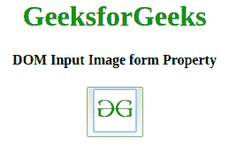
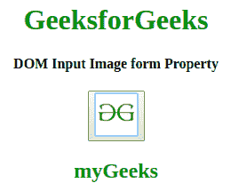

# HTML | DOM 输入图像表单属性

> 原文:[https://www . geesforgeks . org/html-DOM-input-image-form-property/](https://www.geeksforgeeks.org/html-dom-input-image-form-property/)

**HTML DOM 输入图像表单属性**用于返回对包含输入图像字段的表单的引用。它是一个只读属性，在成功时返回一个表单对象。
**语法:**

```html
imageObject.form.id
```

**返回值:**它返回一个字符串值，该值指定包含输入图像字段的表单的引用

下面的例子说明了如何返回表单属性。
**例:**

## 超文本标记语言

```html
<!DOCTYPE html>
<html>

<head>
    <title>
        HTML DOM Input Image form
    </title>
</head>

<body style="text-align:center;">

    <h1 style="color:green;">
      GeeksforGeeks
    </h1>

    <h4>
      DOM Input Image form Property
    </h4>
    <button onclick="my_geek()">
        <form id="myGeeks">
            <input id="myImage" type="image" formAction="test.php"
                   src=
"https://media.geeksforgeeks.org/wp-content/uploads/gfg-40.png"
                   alt="Submit" width="48" height="48" formMethod="post"
                   formNoValidate>

        </form>
    </button>
    <h2 id="Geek_h" style="color:green;"></h2>
    <script>
        function my_geek() {

            // Return target, alt and height.
            var txt = document.getElementById(
                "myImage").form.id;
            document.getElementById(
                "Geek_h").innerHTML = txt;
        }
    </script>
</body>

</html>
```

**输出:**

*   点击按钮前:



*   点击按钮后:



**支持的浏览器:***HTML DOM 输入图像表单属性*支持的浏览器如下:

*   google chrome 10.0
*   Firefox 4.0
*   Opera 11.0
*   Safari 5.1