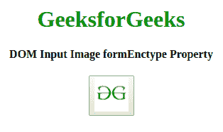
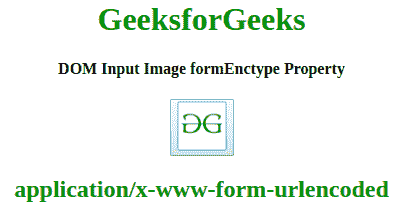
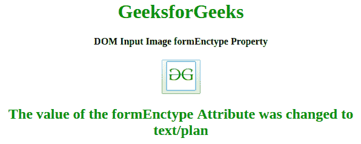

# HTML | DOM 输入图像表单类型属性

> 原文:[https://www . geesforgeks . org/html-DOM-input-image-formenctype-property/](https://www.geeksforgeeks.org/html-dom-input-image-formenctype-property/)

HTML DOM 中的**输入图像表单类型属性**用于设置或返回输入图像的表单类型属性的值。此属性指定将呈现在表单中的数据在提交给服务器时应该被编码。只有当 method = "POST "时，才能使用这种类型的属性。它覆盖了<表单>元素的 enctype 属性。
**语法:**

*   它返回 formEnctype 属性。

    ```html
    imageObject.formEnctype
    ```

*   It is used to set the formEnctype property.

    ```html
    imageObject.formEnctype = "application/x-www-form-urlencoded,
    multipart/form-data, text/plain"
    ```

    **属性值:**

    *   **application/x-www-form-URL encoded:**为默认值。它在发送到服务器之前对所有字符进行编码。它将空格转换成+符号，将特殊字符转换成十六进制值。
    *   **多部分/表单数据:**不编码任何字符。
    *   **文本/普通:**该值将空格转换为+符号，但不转换特殊字符。

    **返回值:**返回一个字符串值，代表表单数据发送到服务器时的编码类型。

    **示例 1:** 这个示例说明了如何返回输入图像表单类型属性。

    ```html
    <!DOCTYPE html>
    <html>

    <head>
        <title>
            HTML DOM Input Image formEnctype
        </title>
    </head>

    <body style="text-align:center;">

        <h1 style="color:green;"> 
          GeeksforGeeks 
        </h1>

        <h4>
          DOM Input Image formEnctype Property
        </h4>
        <button onclick="my_geek()">
            <input id="myImage" formEnctype="application/x-www-form-urlencoded" 
                   type="image" formtarget="#" src=
    "https://media.geeksforgeeks.org/wp-content/uploads/gfg-40.png" 
                   alt="Submit" width="48" height="48" formMethod="post" 
             formNoValidate>
        </button>

        <h2 id="Geek_h" style="color:green;"> 

            </h2>
        <script>
            function my_geek() {

                // Return target, alt and height. 
                var txt = document.getElementById(
                    "myImage").formEnctype;
                document.getElementById(
                    "Geek_h").innerHTML = txt;
            }
        </script>
    </body>

    </html>
    ```

    **输出:**

    *   点击按钮前:
        
    *   点击按钮后:
        

    **示例-2 :** 本示例说明如何设置 formEnctype 属性。

    ```html
    <!DOCTYPE html>
    <html>

    <head>
        <title>
            HTML DOM Input Image formEnctype
        </title>
    </head>

    <body style="text-align:center;">

        <h1 style="color:green;"> 
          GeeksforGeeks 
        </h1>

        <h4>
          DOM Input Image formEnctype Property
        </h4>
        <button onclick="my_geek()">
            <input id="myImage" formEnctype="application/x-www-form-urlencoded" 
                   type="image" formtarget="#" src=
    "https://media.geeksforgeeks.org/wp-content/uploads/gfg-40.png" 
                   alt="Submit" width="48" height="48" formMethod="post"
             formNoValidate>
        </button>

        <h2 id="Geek_h" style="color:green;"></h2>
        <script>
            function my_geek() {

                // Return target, alt and height. 
                var txt = document.getElementById(
                    "myImage").formEnctype = "text/plan";
                document.getElementById(
                    "Geek_h").innerHTML = 
                  "The value of the formEnctype Attribute was changed to "
                  + txt;
            }
        </script>
    </body>

    </html>
    ```

    **输出:**

    *   点击按钮前:
        
    *   点击按钮后:
        

    **支持的浏览器:***HTML DOM 输入图像表单类型属性*支持的浏览器如下:

    *   谷歌 Chrome
    *   微软公司出品的 web 浏览器
    *   火狐浏览器
    *   歌剧
    *   旅行队