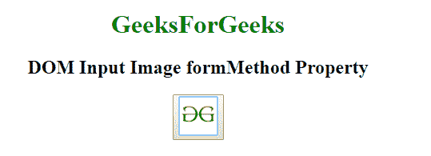
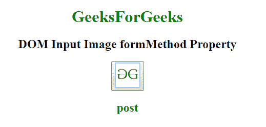
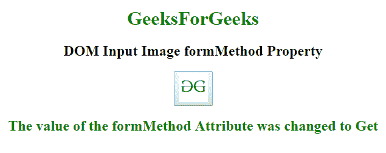

# HTML | DOM 输入图像表单方法属性

> 原文:[https://www . geesforgeks . org/html-DOM-input-image-form method-property/](https://www.geeksforgeeks.org/html-dom-input-image-formmethod-property/)

**HTML DOM 输入图像表单方法属性** **语法:**用于设置或返回输入图像的表单方法属性的值。formMethod 属性用于指定在提交表单时用于发送数据的 HTTP 方法。HTTP 方法有两种，GET 和 POST。该属性覆盖了<表单>元素的方法属性。

**语法:**

*   它返回输入图像表单方法属性。

    ```html
    imageObject.formMethod
    ```

*   它用于设置输入图像表单方法属性。

    ```html
    imageObject.formMethod = get|post
    ```

**属性值:**

*   **GET:** 在 GET 方法中，表单提交后，表单值会在新浏览器选项卡的地址栏中可见。
*   **POST:** 在 POST 方法中，表单提交后，表单值在新浏览器选项卡的地址栏中将不会像在 GET 方法中一样可见。

**返回值:**返回一个字符串值，代表提交表单时发送数据的 HTTP 方法。

**示例 1:** 本示例说明如何返回输入图像表单方法属性。

```html
<!DOCTYPE html> 
<html> 

<head> 
    <title> 
        HTML DOM Input Image formMethod 
    </title> 
</head> 

<body style="text-align:center;"> 

    <h1 style="color:green;"> 
            GeeksForGeeks 
        </h1> 

    <h2>DOM Input Image formMethod</h2> 
    <button onclick="my_geek()"> 
        <input id="myImage"
            type="image" 
            formtarget="#"
src="https://media.geeksforgeeks.org/wp-content/uploads/gfg-40.png"
            alt="Submit"
            width="48" 
            height="48"  formMethod="post"formNoValidate> 
    </button> 

    <h2 id="Geek_h" style="color:green;"> 

        </h2> 
    <script> 
        function my_geek() { 

            // Return target, alt and height. 
            var txt = document.getElementById( 
            "myImage").formMethod;
            document.getElementById( 
            "Geek_h").innerHTML = txt; 
        } 
    </script> 
</body> 

</html> 
```

**输出:**
**点击按钮前:**


**点击按钮后:**


**示例-2:** 该示例说明了如何设置 formMethod 属性。

```html
<!DOCTYPE html> 
<html> 

<head> 
    <title> 
        HTML DOM Input Image formMethod 
    </title> 
</head> 

<body style="text-align:center;"> 

    <h1 style="color:green;"> 
            GeeksForGeeks 
        </h1> 

    <h2>DOM Input Image formMethod Property</h2> 
    <button onclick="my_geek()"> 
        <input id="myImage"
            type="image"
            formtarget="#"
src="https://media.geeksforgeeks.org/wp-content/uploads/gfg-40.png"
            alt="Submit"
            width="48"
            height="48" formMethod="post"formNoValidate> 
    </button> 

    <h2 id="Geek_h" style="color:green;"> 

        </h2> 
    <script> 
        function my_geek() { 

            // Return target, alt and height. 
            var txt = document.getElementById( 
            "myImage").formMethod = "Get";
            document.getElementById( 
            "Geek_h").innerHTML = 
            "The value of the formMethod Attribute was changed to "
             + txt; 
        } 
    </script> 
</body> 

</html>
```

**输出:**
**点击按钮前:**

**点击按钮后:**


**支持的浏览器:****DOM 输入图像表单方法属性**支持的浏览器如下:

*   谷歌 Chrome
*   微软公司出品的 web 浏览器
*   火狐浏览器
*   苹果 Safari
*   歌剧