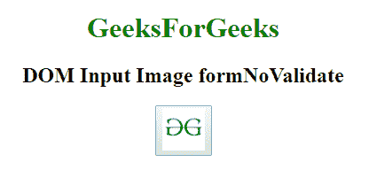
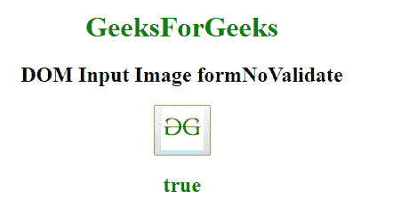
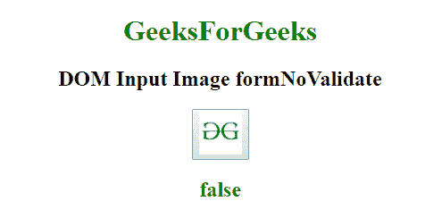

# HTML | DOM 输入图像表单合并属性

> 原文:[https://www . geesforgeks . org/html-DOM-input-image-formnovalidate-property/](https://www.geeksforgeeks.org/html-dom-input-image-formnovalidate-property/)

**HTML DOM 输入图像表单合并属性**用于在用户提交表单时设置或返回表单数据是否经过验证。此属性用于反映 HTML 表单验证属性。

**语法:**

*   它返回 formNoValidate 属性。

    ```html
    imageObject.formNoValidate
    ```

*   它用于设置 formNoValidate 属性。

    ```html
    imageObject.formNoValidate = true|false
    ```

**属性值:**

*   **true:** 指定表单数据不应该被验证。
*   **false:** 为默认值。它指定应该验证表单数据。

**返回值:**返回一个字符串值，表示提交表单时表单数据是否应该被验证。

**示例 1:** 本示例说明如何返回输入图像表单数据属性。

```html
<!DOCTYPE html> 
<html> 

<head> 
    <title> 
        HTML DOM Input Image formNoValidate 
    </title> 
</head> 

<body style="text-align:center;"> 

    <h1 style="color:green;"> 
            GeeksForGeeks 
        </h1> 

    <h2>DOM Input Image formNoValidate</h2> 
    <button onclick="my_geek()"> 
        <input id="myImage"
            type="image" 
            formtarget="#"
src="https://media.geeksforgeeks.org/wp-content/uploads/gfg-40.png"
            alt="Submit"
            width="48" 
            height="48"  formNoValidate> 
    </button> 

    <h2 id="Geek_h" style="color:green;"> 

        </h2> 
    <script> 
        function my_geek() { 

            // Return target, alt and height. 
            var txt = document.getElementById( 
            "myImage").formNoValidate;
            document.getElementById( 
            "Geek_h").innerHTML = txt; 
        } 
    </script> 
</body> 

</html> 
```

**输出:**
**点击按钮前:**


**点击按钮后:**


**示例-2:** 本示例说明如何设置 formNoValidate 属性。

```html
<!DOCTYPE html> 
<html> 

<head> 
    <title> 
        HTML DOM Input Image formNoValidate 
    </title> 
</head> 

<body style="text-align:center;"> 

    <h1 style="color:green;"> 
            GeeksForGeeks 
        </h1> 

    <h2>DOM Input Image formNoValidate</h2> 
    <button onclick="my_geek()"> 
        <input id="myImage"
            type="image" 
            formtarget="#"
src="https://media.geeksforgeeks.org/wp-content/uploads/gfg-40.png"
            alt="Submit"
            width="48" 
            height="48"  formNoValidate> 
    </button> 

    <h2 id="Geek_h" style="color:green;"> 

        </h2> 
    <script> 
        function my_geek() { 

            // Return target, alt and height. 
            var txt = document.getElementById( 
            "myImage").formNoValidate = false;
            document.getElementById( 
            "Geek_h").innerHTML = txt; 
        } 
    </script> 
</body> 

</html> 
```

**输出:**
**点击按钮前:**


**点击按钮后:**


**支持的浏览器:****DOM 输入图像表单融合属性**支持的浏览器如下:

*   谷歌 Chrome
*   微软公司出品的 web 浏览器
*   火狐浏览器
*   歌剧