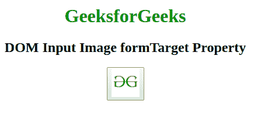
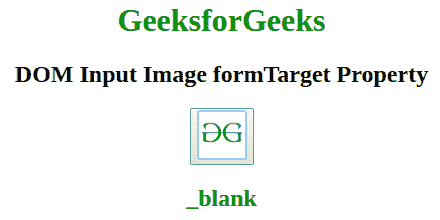
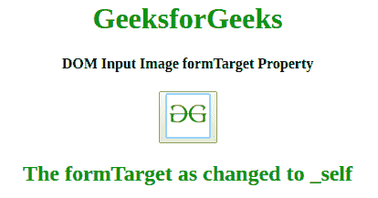

# HTML | DOM 输入图像表单目标属性

> 原文:[https://www . geesforgeks . org/html-DOM-input-image-formtarget-property/](https://www.geeksforgeeks.org/html-dom-input-image-formtarget-property/)

**HTML DOM 输入图像表单目标属性**用于设置或返回具有图像字段的输入元素的**表单目标**的值。目标属性用于指定提交的结果将在当前窗口、新选项卡还是新框架中打开。
**语法:**

*   返回窗体目标属性。

    ```html
    imageObject.formTarget
    ```

*   设置窗体目标属性。

    ```html
    imageObject.formTarget = "_blank|_self|_parent|_top|framename"
    ```

**属性值:**它接受如下所述的五个参数:

*   **_blank:** 定义提交的结果将在新窗口或新标签中打开。
*   **_self:** 指定提交的结果将在同一窗口打开。
*   **_parent:** 指定结果将在父框架集中打开。
*   **_top:** 它指定结果将在窗口的整个主体中打开。
*   **框架名称:**它在一个命名的框架中打开响应。

**返回值:**返回一个字符串值，代表提交的结果是在当前窗口、新标签还是新框架中打开。

**示例 1:** 本示例说明如何返回输入图像表单目标属性。

```html
<!DOCTYPE html>
<html>

<head>
    <title>
        HTML DOM Input Image formTarget Property
    </title>
</head>

<body style="text-align:center;">

    <h1 style="color:green;"> 
      GeeksforGeeks 
    </h1>

    <h2>
      DOM Input Image formTarget Property
    </h2>
    <button onclick="my_geek()">
        <input id="myImage" name="myGeeks" type="image" src=
"https://media.geeksforgeeks.org/wp-content/uploads/gfg-40.png" 
               alt="Submit" formaction="#" a formtarget="_blank" 
               formenctype="text/plain" width="48" height="48">
    </button>
    <h2 id="Geek_h" style="color:green;"></h2>
    <script>
        function my_geek() {

            // Return formTarget, formEnctype and formAction. 
            var txt = document.getElementById(
                "myImage").formTarget;
            document.getElementById("Geek_h").innerHTML = txt;
        }
    </script>
</body>

</html>
```

**输出:**

*   点击按钮前:
    
*   点击按钮后:
    

**示例 2:** 本示例说明如何设置属性。

```html
<!DOCTYPE html>
<html>

<head>
    <title>
        HTML DOM Input Image formTarget Property
    </title>
</head>

<body style="text-align:center;">

    <h1 style="color:green;"> 
     GeeksforGeeks 
    </h1>

    <h4>
      DOM Input Image formTarget Property
    </h4>
    <button onclick="my_geek()">
        <input id="myImage" name="myGeeks" type="image" src=
"https://media.geeksforgeeks.org/wp-content/uploads/gfg-40.png"
               alt="Submit" formaction="#" a formtarget="_blank" 
               formenctype="text/plain" width="48" height="48">
    </button>
    <h2 id="Geek_h" style="color:green;"> 

        </h2>
    <script>
        function my_geek() {

            // Return formTarget, formEnctype and formAction. 
            var txt = document.getElementById(
                "myImage").formTarget = "_self";
            document.getElementById("Geek_h").innerHTML =
              "The formTarget as changed to " + txt;
        }
    </script>
</body>

</html>
```

**输出:**

*   点击按钮前:
    
*   点击按钮后:
    

**支持的浏览器:***HTML DOM 输入图片表单目标属性*支持的浏览器如下:

*   谷歌 Chrome 9.0
*   Internet Explorer 10.0
*   Firefox 4.0
*   歌剧 10.6
*   Safari 5.1