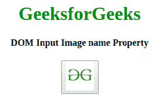

# HTML | DOM 输入图像名称属性

> 原文:[https://www . geesforgeks . org/html-DOM-input-image-name-property/](https://www.geeksforgeeks.org/html-dom-input-image-name-property/)

**HTML DOM 输入图像名称属性**用于设置或返回输入图像的名称属性值。**名称**属性用于在提交表单后引用表单数据或引用 JavaScript 中的元素。
**语法:**

*   返回名称属性:

```html
imageObject.name
```

*   要设置名称属性:

```html
imageObject.name
```

**属性值:**接受单个参数**名称**，并指定输入图像的名称。
**返回值:**返回代表输入图像名称的字符串值。
**例 1:** 这个程序说明了如何返回 Property 这个名字。

## 超文本标记语言

```html
<!DOCTYPE html>
<html>

<head>
    <title>
        HTML DOM Input Image name Property
    </title>
</head>

<body style="text-align:center;">

    <h1 style="color:green;">
      GeeksforGeeks
    </h1>

    <h4>
      DOM Input Image name Property
    </h4>
    <button onclick="my_geek()">
        <input id="myImage" name="myGeeks" type="image" src=
"https://media.geeksforgeeks.org/wp-content/uploads/gfg-40.png"
               alt="Submit" formaction="#" a formtarget="#"
               formenctype="text/plain" width="48" height="48">
    </button>
    <h2 id="Geek_h" style="color:green;"></h2>
    <script>
        function my_geek() {

            // Return formTarget, formEnctype and formAction.
            var txt = document.getElementById(
                "myImage").name;
            document.getElementById("Geek_h").innerHTML = txt;
        }
    </script>
</body>

</html>
```

**输出:**

*   点击按钮前:



*   点击按钮后:


**示例 2:** 本示例说明如何设置名称属性。

## 超文本标记语言

```html
<!DOCTYPE html>
<html>

<head>
    <title>
        HTML DOM Input Image name Property
    </title>
</head>

<body style="text-align:center;">

    <h1 style="color:green;">
      GeeksforGeeks
    </h1>

    <h4>
      DOM Input Image name Property
    </h4>
    <button onclick="my_geek()">
        <input id="myImage" name="myGeeks" type="image" src=
"https://media.geeksforgeeks.org/wp-content/uploads/gfg-40.png"
               alt="Submit" formaction="#" a formtarget="#"
               formenctype="text/plain" width="48" height="48">
    </button>
    <h2 id="Geek_h" style="color:green;"></h2>
    <script>
        function my_geek() {

            // Return formTarget, formEnctype and formAction.
            var txt = document.getElementById(
                "myImage").name =
                "The value of the name attribute was changed to "
                                                  + "Hello Geeks";
            document.getElementById("Geek_h").innerHTML = txt;
        }
    </script>
</body>

</html>
```

**输出:**

*   点击按钮前:


*   点击按钮后:


**支持的浏览器:**以下是 *HTML | DOM 输入图像名称属性*支持的浏览器:

*   谷歌 Chrome
*   微软公司出品的 web 浏览器
*   火狐浏览器
*   歌剧
*   旅行队