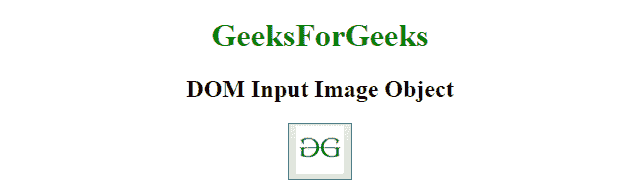
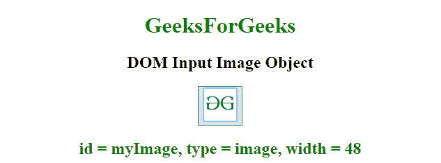
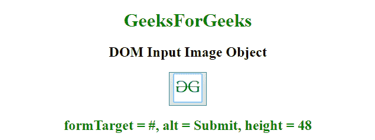
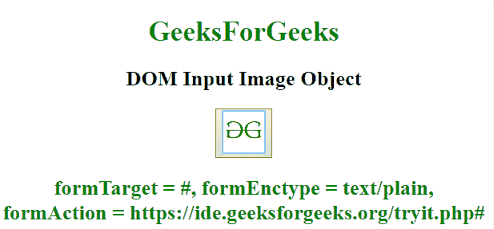

# HTML | DOM 输入图像对象

> 原文:[https://www.geeksforgeeks.org/html-dom-input-image-object/](https://www.geeksforgeeks.org/html-dom-input-image-object/)

HTML DOM 中的**输入图像对象**用 **type="image"** 表示 **HTML <输入>** 元素。
该标签用于*访问*或*创建*元素。可以使用 **getElementById()方法**访问该元素。

**语法:**

```html
document.getElementById("MyImage");

```

**返回值:**返回 **<的属性，输入带有**标签的>** 。**

**属性值:**

| 价值 | 描述 |
| 中高音 | 设置/返回输入图像的 alt 属性值。 |
| 自（动）调焦装置 | 如果页面加载时输入图像自动获得焦点，则设置/返回。 |
| 缺省值 | 设置/返回输入图像的默认值。 |
| 有缺陷的 | 设置/返回输入图像是否被禁用。 |
| 形式 | 返回包含输入图像的窗体的引用。 |
| 表单动作 | 设置/返回输入图像的 formaction 属性值。 |
| 表单 enctype | 设置/返回输入图像的 formenctype 属性值。 |
| 形法 | 设置/返回输入图像的 formmethod 属性值。 |
| formNoValidate | 提交时设置/返回表单数据是否有效。 |
| 表单目标 | 设置/返回输入图像的 formtarget 属性值。 |
| 高度 | 设置/返回输入图像的高度属性值。 |
| 名字 | 设置/返回输入图像的名称属性值。 |
| 科学研究委员会 | 设置/返回输入图像的 src 属性值。 |
| 类型 | 返回输入元素的表单元素类型。 |
| 价值 | 设置/返回输入图像的值属性值。 |
| 宽度 | 设置/返回输入图像的宽度属性值。 |

**示例-1:** 访问输入元素并返回 ID、类型和宽度。

```html
<!DOCTYPE html>
<html>

<head>
    <title>
        HTML DOM Input Image Object
    </title>
</head>

<body style="text-align:center;">

    <h1 style="color:green;">  
            GeeksForGeeks  
        </h1>

    <h2>DOM Input Image Object</h2>
    <button onclick="my_geek()">
        <input id="myImage" 
               type="image" 
src="https://media.geeksforgeeks.org/wp-content/uploads/gfg-40.png"
               alt="Submit" 
               width="48" 
               height="48">
    </button>
    <h2 id="Geek_h" style="color:green;"> 

        </h2>
    <script>
        function my_geek() {

            // Access myImage and return id 
            var txt = document.getElementById(
              "myImage").id;

            txt = "id = " + txt + ", ";

            // Return type
            txt += "type = " + document.getElementById(
              "myImage").type + ", ";

            // Return Width
            txt += "width = " + document.getElementById(
              "myImage").width;
            document.getElementById(
              "Geek_h").innerHTML = txt;
        }
    </script>
</body>

</html>
```

**输出**

*   **之前点击按钮:**
    
*   **点击按钮后:**
    

**示例-2:** 访问输入元素并返回目标、alt 和高度。

```html
<!DOCTYPE html>
<html>

<head>
    <title>
        HTML DOM Input Image Object
    </title>
</head>

<body style="text-align:center;">

    <h1 style="color:green;"> 
            GeeksForGeeks 
        </h1>

    <h2>DOM Input Image Object</h2>
    <button onclick="my_geek()">
        <input id="myImage"
               type="image" 
               formtarget="#"
src="https://media.geeksforgeeks.org/wp-content/uploads/gfg-40.png" 
               alt="Submit" 
               width="48" 
               height="48">
    </button>

    <h2 id="Geek_h" style="color:green;"> 

        </h2>
    <script>
        function my_geek() {

            // Return target, alt and height.
            var txt = document.getElementById(
              "myImage").formTarget;
            txt = "formTarget = " + txt + ", ";
            txt += "alt = " + document.getElementById(
              "myImage").alt + ", ";
            txt += "height = " + document.getElementById(
              "myImage").height;
            document.getElementById(
              "Geek_h").innerHTML = txt;
        }
    </script>
</body>

</html>
```

**输出**

*   **之前点击按钮:**
    
*   **点击按钮后:**
    

**示例-3:** 访问输入元素并返回 formTarget、formEnctype 和 formAction。

```html
<!DOCTYPE html>
<html>

<head>
    <title>
        HTML DOM Input Image Object
    </title>
</head>

<body style="text-align:center;">

    <h1 style="color:green;">  
            GeeksForGeeks  
        </h1>

    <h2>DOM Input Image Object</h2>
    <button onclick="my_geek()">
        <input id="myImage"
               type="image" 
src="https://media.geeksforgeeks.org/wp-content/uploads/gfg-40.png" 
               alt="Submit" 
               formaction="#" 
               formtarget="#" 
               formenctype="text/plain"
               width="48" 
               height="48">
    </button>
    <h2 id="Geek_h" style="color:green;"> 

        </h2>
    <script>
        function my_geek() {

            // Return formTarget, formEnctype and formAction.
            var txt = document.getElementById(
              "myImage").formTarget;
            txt = "formTarget = " + txt + ", ";
            txt += "formEnctype = " + document.getElementById(
              "myImage").formEnctype + ", ";
            txt += "formAction = " + document.getElementById(
              "myImage").formAction;
            document.getElementById(
              "Geek_h").innerHTML = txt;
        }
    </script>
</body>

</html>
```

**输出**

*   **之前点击按钮:**
    
*   **点击按钮后:**
    

**支持的浏览器:**

*   谷歌 Chrome
*   Mozilla Firefox
*   边缘
*   旅行队
*   歌剧