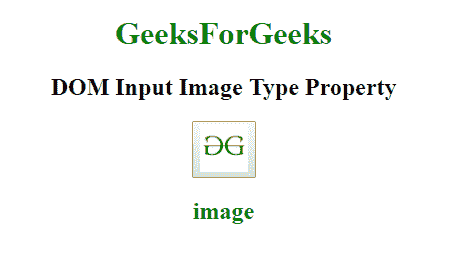

# HTML | DOM 输入图像类型属性

> 原文:[https://www . geesforgeks . org/html-DOM-input-image-type-property/](https://www.geeksforgeeks.org/html-dom-input-image-type-property/)

HTML DOM 中的**输入图像类型属性**用于返回图像字段是哪种类型的表单元素。

**语法:**

```html
ImageObject.type 
```

**返回值:**返回一个字符串值，代表图像字段的形式元素类型。

以下示例返回图像类型属性。

**示例:**

```html
<!DOCTYPE html>
<html>

<head>
    <title>
        HTML DOM Input Image type Property
    </title>
</head>

<body style="text-align:center;">

    <h1 style="color:green;"> 
            GeeksForGeeks 
        </h1>

    <h2>DOM Input Image Type Property</h2>
    <button onclick="my_geek()">
        <input id="myImage"
               value="myGeeks"
               type="image"
               src=
"https://media.geeksforgeeks.org/wp-content/uploads/gfg-40.png"
               alt="Submit" 
               formaction="#" 
               formtarget="#" 
               formenctype="text/plain" 
               width="48"
               height="48">
    </button>
    <h2 id="Geek_h" 
        style="color:green;"> 

        </h2>
    <script>
        function my_geek() {

            // Return formTarget,
          //ormEnctype and formAction. 
            var txt = document.getElementById(
                "myImage").type;
            document.getElementById(
                "Geek_h").innerHTML = txt;
        }
    </script>
</body>

</html>
```

**输出:**
**点击按钮前:**

**点击按钮后:**


**支持的浏览器:****DOM 输入图像类型属性**支持的浏览器如下:

*   谷歌 Chrome
*   微软公司出品的 web 浏览器
*   火狐浏览器
*   苹果 Safari
*   歌剧