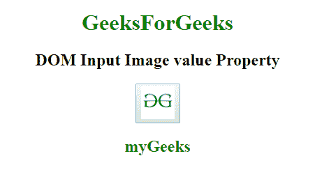

# HTML | DOM 输入图像值属性

> 原文:[https://www . geesforgeks . org/html-DOM-input-image-value-property/](https://www.geeksforgeeks.org/html-dom-input-image-value-property/)

HTML DOM 中的**输入图像值属性**用于设置或返回输入图像的值属性的值。

**语法:**

*   它返回属性值。

    ```html
    imageObject.value
    ```

*   它设置属性值。

    ```html
    imageObject.value = value;
    ```

**属性值**它包含值**文本**，指定输入图像的值

**返回值**返回一个代表输入图像值的数值。

**示例:**本示例返回输入图像值属性。

```html
<!DOCTYPE html>
<html>

<head>
    <title>
        HTML DOM Input Image value Property
    </title>
</head>

<body style="text-align:center;">

    <h1 style="color:green;"> 
            GeeksForGeeks 
        </h1>

    <h2>DOM Input Image value Property</h2>
    <button onclick="my_geek()">
        <input id="myImage"
               value="myGeeks" 
               type="image" 
               src=
"https://media.geeksforgeeks.org/wp-content/uploads/gfg-40.png" 
               alt="Submit" 
               formaction="#"
               formtarget="#" 
               formenctype="text/plain" 
               width="48"
               height="48">
    </button>
    <h2 id="Geek_h"
        style="color:green;"> 

        </h2>
    <script>
        function my_geek() {

            // Return formTarget,
            // formEnctype and formAction. 
            var txt = document.getElementById(
                "myImage").value;
            document.getElementById(
                "Geek_h").innerHTML = txt;
        }
    </script>
</body>

</html>
```

**输出:**
**点击按钮前:**


**点击按钮后:**


**示例-2:** 本示例设置输入图像值属性。

```html
<!DOCTYPE html>
<html>

<head>
    <title>
        HTML DOM Input Image value Property
    </title>
</head>

<body style="text-align:center;">

    <h1 style="color:green;"> 
            GeeksForGeeks 
        </h1>

    <h2>DOM Input Image value Property</h2>
    <button onclick="my_geek()">
        <input id="myImage"
               value="myGeeks" 
               type="image" 
               src=
"https://media.geeksforgeeks.org/wp-content/uploads/gfg-40.png" 
               alt="Submit" 
               formaction="#" 
               formtarget="#" 
               formenctype="text/plain" 
               width="48" 
               height="48">
    </button>
    <h2 id="Geek_h"
        style="color:green;"> 

        </h2>
    <script>
        function my_geek() {

            // Return formTarget,
            // formEnctype and formAction. 
            var txt = document.getElementById(
                "myImage").value = "Hello Geeks";

            document.getElementById(
                "Geek_h").innerHTML =
              "The value was changed to " + txt;
        }
    </script>
</body>

</html>
```

**输出:**
**点击按钮前:**


**点击按钮后:**


**支持的浏览器:****DOM 输入图像值属性**支持的浏览器如下:

*   谷歌 Chrome
*   微软公司出品的 web 浏览器
*   火狐浏览器
*   苹果 Safari
*   歌剧