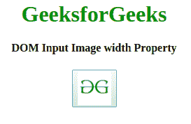
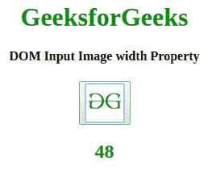
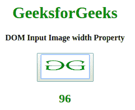

# HTML | DOM 输入图像宽度属性

> 原文:[https://www . geesforgeks . org/html-DOM-input-image-width-property/](https://www.geeksforgeeks.org/html-dom-input-image-width-property/)

HTML DOM 中的**输入图像宽度属性**用于返回 *<输入类型=【图像】>* 的宽度属性值。

**语法:**

*   返回宽度属性。

    ```html
    imageObject.width
    ```

*   设置宽度属性。

    ```html
    imageObject.width = value;
    ```

**属性值:**包含以像素为单位指定图像宽度的数值。

**返回值:**返回代表图像宽度的数值。

**示例 1:** 本示例返回输入图像宽度属性。

```html
<!DOCTYPE
<html> 

<head> 
    <title> 
        HTML DOM Input Image width Property
    </title> 
</head> 

<body style="text-align:center;"> 

    <h1 style="color:green;"> 
      GeeksforGeeks 
    </h1> 

    <h4>
      DOM Input Image width Property
    </h4> 
    <button onclick="my_geek()"> 
        <input id="myImage"
            type="image" src=
"https://media.geeksforgeeks.org/wp-content/uploads/gfg-40.png"
            alt="Submit" 
            formaction="#"
            formtarget="#"
            formenctype="text/plain"
            width="48"
            height="48"> 
    </button> 
    <h2 id="Geek_h" style="color:green;"></h2> 
    <script> 
        function my_geek() { 

            // Return formTarget, formEnctype and formAction. 
            var txt = document.getElementById( 
            "myImage").width;
            document.getElementById( 
            "Geek_h").innerHTML = txt; 
        } 
    </script> 
</body> 

</html> 
```

**输出:**

*   点击按钮前:
    
*   点击按钮后:
    

**示例 2:** 本示例设置输入图像宽度属性。

```html
<!DOCTYPE html> 
<html> 

<head> 
    <title> 
        HTML DOM Input Image width Property
    </title> 
</head> 

<body style="text-align:center;"> 

    <h1 style="color:green;"> 
      GeeksforGeeks 
    </h1> 
    <h4>
      DOM Input Image width Property
    </h4> 
    <button onclick="my_geek()"> 
        <input id="myImage"
            type="image" src=
"https://media.geeksforgeeks.org/wp-content/uploads/gfg-40.png"
            alt="Submit"
            formaction="#"
            formtarget="#"
            formenctype="text/plain"
            width="48"
            height="48"> 
    </button> 
    <h2 id="Geek_h" style="color:green;"></h2> 
    <script> 
        function my_geek() { 

            // Return formTarget, formEnctype and formAction. 
            var txt = document.getElementById( 
            "myImage").width = "96";
            document.getElementById( 
            "Geek_h").innerHTML = txt; 
        } 
    </script> 
</body> 

</html>                    
```

**输出:**

*   点击按钮前:
    
*   点击按钮后:
    

**支持的浏览器:***HTML DOM 输入图像宽度属性*支持的浏览器如下:

*   谷歌 Chrome
*   微软公司出品的 web 浏览器
*   火狐浏览器
*   歌剧
*   旅行队