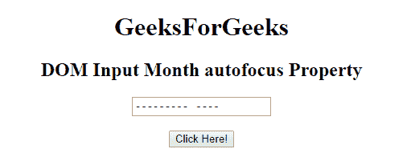
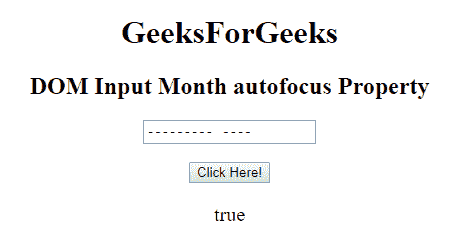
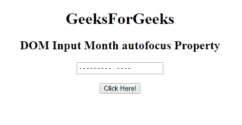
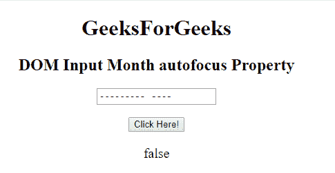

# HTML | DOM 输入月份自动对焦属性

> 原文:[https://www . geesforgeks . org/html-DOM-input-month-autofocus-property/](https://www.geeksforgeeks.org/html-dom-input-month-autofocus-property/)

HTML DOM 中的 **DOM 输入月自动对焦**属性用于**设置**或**返回**页面加载时输入月字段是否应该对焦。它反映了 HTML 自动对焦属性。

**语法:**

*   它返回自动对焦属性。

    ```html
    monthObject.autofocus
    ```

*   它用于设置自动对焦属性。

    ```html
    monthObject.autofocus = "true|false"
    ```

**属性值:**

*   **true:** 设置月场焦点。
*   **假:**有默认值。它定义了月份字段不能获得焦点。

**返回值:**返回一个布尔值，代表月字段是否自动对焦。

**示例-1:** 本示例返回输入月份自动对焦属性。

```html
<!DOCTYPE html>
<html>

<head>
    <title>
        HTML DOM Input Month autofocus Property
    </title>
</head>

<body style="text-align:center;">

    <h1>GeeksForGeeks</h1>

    <h2>DOM Input Month autofocus Property</h2>
    <form id="myGeeks">
        <input type="month"
               id="month_id"
               name="geeks"
               autofocus>
    </form>
    <br>
    <button onclick="myGeeks()">
      Click Here!
  </button>

    <p id="GFG" 
       style="font-size:20px;">
  </p>

    <!-- Script to return 
       the autofocus  Property-->
    <script>
        function myGeeks() {

            // Return the month autofocus property.
            var gfg = 
                document.getElementById(
                  "month_id").autofocus;

            document.getElementById(
              "GFG").innerHTML = gfg;
        }
    </script>
</body>

</html>
```

**输出:**
**点击按钮前:**


**点击按钮后:**


**示例-2:** 本示例说明如何**设置**属性。

```html
<!DOCTYPE html>
<html>

<head>
    <title>
        HTML DOM Input Month autofocus Property
    </title>
</head>

<body style="text-align:center;">

    <h1>GeeksForGeeks</h1>

    <h2>
      DOM Input Month autofocus Property
  </h2>
    <form id="myGeeks">
        <input type="month" 
               id="month_id" 
               name="geeks" 
               autofocus>
    </form>
    <br>
    <button onclick="myGeeks()">
      Click Here!
  </button>

    <p id="GFG" 
       style="font-size:20px;">
  </p>

    <!-- Script to set the
      autofocus Property-->
    <script>
        function myGeeks() {

            // Set autofocus property
            var gfg = 
            document.getElementById("month_id");
            gfg.autofocus = false;
            var g = gfg.autofocus;

            document.getElementById(
              "GFG").innerHTML = g;
        }
    </script>
</body>

</html>
```

**输出:**
**点击按钮前:**

**点击按钮后:**


**支持的浏览器:**T2 DOM 输入月自动对焦属性支持的浏览器如下:

*   谷歌 Chrome
*   Internet Explorer 10.0 +
*   火狐浏览器
*   歌剧
*   旅行队

**注意:**在 Firefox 中，输入 **type="month"** 元素不显示任何日期字段或日历。