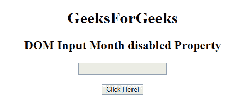
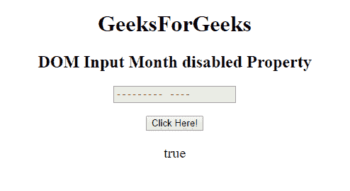
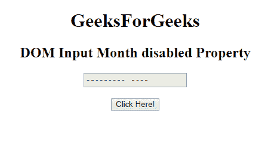
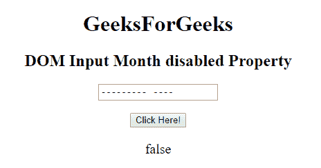

# HTML | DOM 输入月禁用属性

> 原文:[https://www . geesforgeks . org/html-DOM-input-month-disabled-property/](https://www.geeksforgeeks.org/html-dom-input-month-disabled-property/)

HTML DOM 中的 **DOM 输入月禁用**属性用于**返回**一个布尔值，表示*月字段是否应禁用*。
禁用的元素默认显示为灰色，不可用且不可点击。

**语法:**

*   它返回禁用的属性。

    ```html
    monthObject.disabled
    ```

*   它用于设置禁用属性。

    ```html
    monthObject.disabled = true
    ```

**属性值:**

*   **true:** 指定月字段被禁用。
*   **false:** 指定未禁用月字段。

**返回值:**返回一个布尔值，即如果月字段被禁用则为真，如果月字段未被禁用则为假。

**示例-1:** 本示例返回禁用属性的值。

```html
<!DOCTYPE html>
<html>

<head>
    <title>
        HTML DOM Input Month disabled Property
    </title>
</head>

<body style="text-align:center;">

    <h1>GeeksForGeeks</h1>

    <h2>
      DOM Input Month disabled Property
  </h2>
    <form id="myGeeks">
        <input type="month"
               id="month_id" 
               name="geeks" 
               disabled>
    </form>
    <br>
    <button onclick="myGeeks()">
      Click Here!
  </button>

    <p id="GFG" 
       style="font-size:20px;">
  </p>

    <!-- Script to return the
     value of disabled property-->
    <script>
        function myGeeks() {

            var gfg = 
              document.getElementById(
                "month_id").disabled;

            document.getElementById(
              "GFG").innerHTML = gfg;
        }
    </script>
</body>

</html>
```

**输出**
**点击按钮前:**


**点击按钮后:**


**示例-2:** 本示例说明如何**设置或更改**禁用属性。

```html
<!DOCTYPE html>
<html>

<head>
    <title>
        HTML DOM Input Month disabled Property
    </title>
</head>

<body style="text-align:center;">

    <h1>GeeksForGeeks</h1>

    <h2>
      DOM Input Month disabled Property
  </h2>
    <form id="myGeeks">
        <input type="month"
               id="month_id" 
               name="geeks" 
               disabled>
    </form>
    <br>
    <button onclick="myGeeks()">
      Click Here!
  </button>

    <p id="GFG"
       style="font-size:20px;">
  </p>

    <!-- Script to set the disabled
        attribute of Month field-->
    <script>
        function myGeeks() {

            var gfg = 
              document.getElementById("month_id");
            gfg.disabled = false;
            var g = gfg.disabled;

            document.getElementById(
              "GFG").innerHTML = g;
        }
    </script>
</body>

</html>
```

**输出:**
**点击按钮前:**


**点击按钮后:**


**支持的浏览器:**T2 DOM 输入月禁用属性支持的浏览器如下:

*   谷歌 Chrome
*   Internet Explorer 10.0 +
*   火狐浏览器
*   歌剧
*   旅行队

**注意:**在 Firefox 中，输入 **type="month"** 元素不显示任何日期字段或日历。