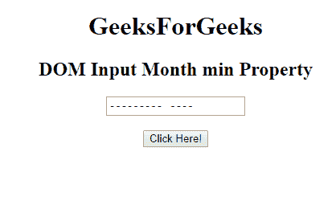

# HTML | DOM 输入月最小属性

> 原文:[https://www . geesforgeks . org/html-DOM-input-month-min-property/](https://www.geeksforgeeks.org/html-dom-input-month-min-property/)

HTML DOM 中的 **DOM 输入月最小值**属性用于**设置**或**返回** *月字段的最小值属性的值*。min 属性为“月”字段指定最小的月和年值。

**语法:**

*   它返回 min 属性。

    ```html
    monthObject.min
    ```

*   它用于设置 min 属性。

    ```html
    monthObject.min = YYYY-MM
    ```

**属性值:**

*   **YYYY-MM:** 该值表示最小的年和月。这里 YYYY 是年份即 2019，MM 是月份即 03。

**返回值:**返回一个字符串，代表月字段允许的最小值。

**示例-1:** 本示例返回输入月最小值属性。

```html
<!DOCTYPE html>
<html>

<head>
    <title>
        HTML DOM Input Month min Property
    </title>
</head>

<body style="text-align:center;">

    <h1>GeeksForGeeks</h1>

    <h2>
      DOM Input Month min Property
  </h2>
    <form id="myGeeks">
        <input type="month"
               id="month_id"
               name="geeks"
               min="2019-01">
    </form>
    <br>
    <button onclick="myGeeks()">
      Click Here!
  </button>

    <p id="GFG" 
       style="font-size:20px;">
  </p>

    <!-- Script to return 
      the min property-->
    <script>
        function myGeeks() {

          var gfg = 
             document.getElementById(
               "month_id").min;

            document.getElementById(
              "GFG").innerHTML = gfg;
        }
    </script>
</body>

</html>
```

**输出**
**点击按钮前:**


**点击按钮后:**


**示例-2:** 本示例说明如何**设置**属性。

```html
<!DOCTYPE html>
<html>

<head>
    <title>
        HTML DOM Input Month min Property
    </title>
</head>

<body style="text-align:center;">

    <h1>GeeksForGeeks</h1>

    <h2>
      DOM Input Month min Property
  </h2>
    <form id="myGeeks">
        <input type="month" 
               id="month_id" 
               name="geeks">
    </form>
    <br>
    <button onclick="myGeeks()">
      Click Here!
  </button>

    <p id="GFG" 
       style="font-size:20px;">
  </p>

    <!-- Script to set the min property-->
    <script>
        function myGeeks() {

            var gfg =
                document.getElementById(
                  "month_id");
            gfg.min = "2019-01";
            var g = gfg.min;

            document.getElementById(
              "GFG").innerHTML = g;
        }
    </script>
</body>

</html>
```

**输出:**
**点击按钮前:**


**点击按钮后:**


**支持的浏览器:**T2 DOM 输入月最小属性支持的浏览器如下:

*   谷歌 Chrome
*   Internet Explorer 10.0 +
*   火狐浏览器
*   歌剧
*   旅行队

**注意:**在 Firefox 中，输入 type="month "元素不显示任何日期字段或日历。