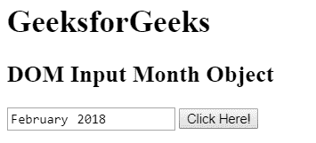
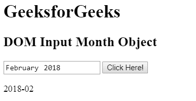
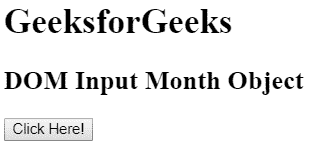
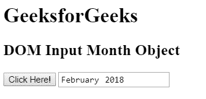

# HTML | DOM 输入月份对象

> 原文:[https://www.geeksforgeeks.org/html-dom-input-month-object/](https://www.geeksforgeeks.org/html-dom-input-month-object/)

HTML DOM 中的**输入月对象**用于表示具有*类型=“月”*属性的 HTML 输入元素。使用 getElementById()方法可以访问具有*类型=“月”*属性的输入元素。

**语法:**

*   用于访问 type="month "属性的<input> lemon。

```html
document.getElementById("id");
```

*   用于创建 type="month "属性的<input>柠檬。

```html
document.createElement("input");
```

**属性值:**

<figure class="table">

| attribute | describe |
| type | This property is used to return the form element type of the month field. |
| value | This property is used to set or return the value of the value property of the month field. |
| Automatic completion | This property is used to set or return the value of the auto-completion property of the month field. |
| auto-focusing | This property is used to set or return whether the month field should be autofocused when the page is loaded. |
| default | This property is used to set or return the default value of the month field. |
| forbidden | This property is used to set or return whether the month field is disabled. |
| sheet/form | This property is used to return a reference to the form that contains the month field. |
| tabulation/listing | This property is used to return a reference to the data list containing the month field. |
| 最大 | This property is used to set or return the value of the max property of a month field. |
| 部 | This property is used to set or return the value of the min property of the month field. |
| name | This property is used to set or return the value of the name property of the month field. |
| placeholder | This property is used to set or return the value of the placeholder property of the month field. |
| read only | This property is used to set or return whether the month field is read only. |
| Required | This property is used to set or return whether the month field must be filled in before submitting the form. |
| step | This property is used to set or return the value of the step property of the month field. |

</figure>

**输入月份对象方法:**

<figure class="table">

| 方法 | 描述 |
| 逐步下降() | 此方法用于将输入月份的值递减指定的数字。 |
| stepUp() | 此方法用于将输入月份的值增加指定的数字。 |

</figure>

**示例 1:** 本示例使用 getElementById()方法访问<输入具有 type="month "属性的>元素。

## 超文本标记语言

```html
<!DOCTYPE html>
<html>

<head>
    <title>
        HTML DOM Input Month Object
    </title>
</head>

<body>

    <h1>GeeksforGeeks</h1>

    <h2>DOM Input Month Object</h2>

    <input type = "month" id = "month" value = "2018-02">

    <button onclick = "myGeeks()">Click Here!</button>

    <p id = "GFG"></p>

    <!-- script to access input element of
        type month attribute -->
    <script>
        function myGeeks() {
            var val = document.getElementById("month").value;
            document.getElementById("GFG").innerHTML = val;
        }
    </script>
</body>

</html>                   
```

**输出:**
**之前点击按钮:**



**点击按钮后:**



**示例 2:** 本示例使用 document.createElement()方法创建<输入具有 type="month "属性的>元素。

## 超文本标记语言

```html
<!DOCTYPE html>
<html>

<head>
    <title>
        HTML DOM Input Month Object
    </title>
</head>

<body>

    <h1>GeeksforGeeks</h1>

    <h2>DOM Input Month Object</h2>

    <button onclick = "myGeeks()">Click Here!</button>

    <!-- script to create input element of
        type month attribute -->
    <script>
        function myGeeks() {

            /* Create an input element */
            var x = document.createElement("INPUT");

            /* Set the type attribute */
            x.setAttribute("type", "month");

            /* Set the value to type attribute */
            x.setAttribute("value", "2018-02");

            /* Append the element to body tag */
            document.body.appendChild(x);
        }
    </script>
</body>

</html>                   
```

**输出:**
**之前点击按钮:**



**点击按钮后:**



**支持的浏览器:**

*   谷歌 Chrome
*   互联网浏览器(IE 11 之后)
*   歌剧
*   旅行队