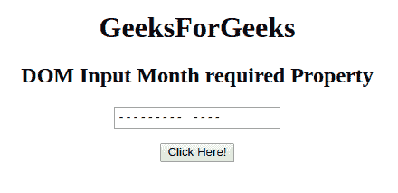
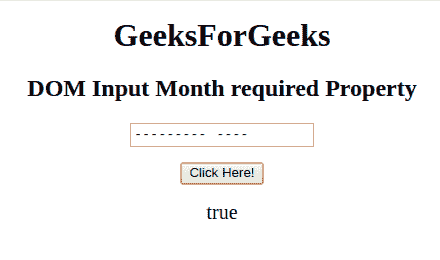
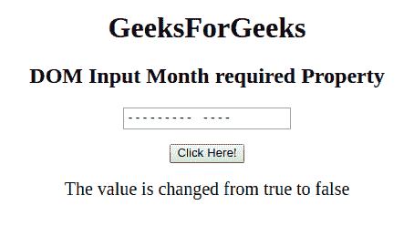

# HTML | DOM 输入月份必填属性

> 原文:[https://www . geesforgeks . org/html-DOM-input-month-required-property/](https://www.geeksforgeeks.org/html-dom-input-month-required-property/)

HTML DOM 中的需要输入月份属性用于设置或返回提交表单时是否需要填写输入月份字段。此属性用于反映 HTML 必需的属性。

**语法:**

*   它返回输入月份必需属性。

    ```html
    monthObject.required
    ```

*   它用于设置输入月份必需属性。

    ```html
    monthObject.required = true|false
    ```

**属性值:**

*   **true:** 指定提交表单前必须填写月字段。
*   **false:** 为默认值。它指定在提交表单之前不得填写月字段。

**返回值:**返回一个布尔值，代表提交表单前是否必须填写月字段。

**示例-1:** 本示例返回输入月份必需属性。

```html
<!DOCTYPE html> 
<html> 

<head> 
    <title> 
        HTML DOM Input Month required Property
    </title> 
</head> 

<body style="text-align:center;"> 

    <h1>GeeksForGeeks</h1> 

    <h2>DOM Input Month required Property</h2> 
            <form id="myGeeks">
    <input type="month" id="month_id" name="geeks" required> 
                 </form>
                 <br>
    <button onclick="myGeeks()">Click Here!</button> 

    <p id="GFG" style="font-size:20px;"></p> 

    <!-- Script to return the required Property-->
    <script> 
        function myGeeks() { 
            var gfg = document.getElementById("month_id").required;
            document.getElementById("GFG").innerHTML = gfg;
        } 
    </script> 
</body> 

</html>                     
```

**输出**
**点击按钮前:**


**点击按钮后:**


**示例-2:** 本示例说明如何**设置**属性。

```html
<!DOCTYPE html> 
<html> 

<head> 
    <title> 
        HTML DOM Input Month required Property
    </title> 
</head> 

<body style="text-align:center;"> 

    <h1>GeeksForGeeks</h1> 

    <h2>DOM Input Month required Property</h2> 
            <form id="myGeeks">
    <input type="month" id="month_id" name="geeks" required> 
                </form>
                <br>
    <button onclick="myGeeks()">Click Here!</button> 

    <p id="GFG" style="font-size:20px;"></p> 

    <!-- Script to set the required Property-->
    <script> 
        function myGeeks() { 
            var gfg = document.getElementById("month_id");
            gfg.required = false;
            var g =    gfg.required;        
            document.getElementById("GFG").innerHTML = 
                        "The value is changed from true to " + g;
        } 
    </script> 
</body> 

</html>                    
```

**输出:**
**点击按钮前:**


**点击按钮后:**


**支持的浏览器:**支持的浏览器 **DOM 输入月所需属性**如下:

*   谷歌 Chrome
*   Internet Explorer 10.0 +
*   火狐浏览器
*   歌剧
*   旅行队

**注意:**在 Firefox 中，输入 type="month "元素不显示任何日期字段或日历。