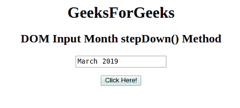
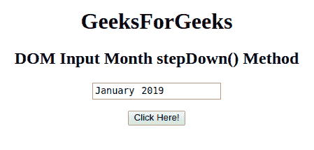

# HTML | DOM 输入月步降()方法

> 原文:[https://www . geesforgeks . org/html-DOM-input-month-step down-method/](https://www.geeksforgeeks.org/html-dom-input-month-stepdown-method/)

HTML DOM 中的 **DOM 输入月步降()**方法用于将月字段的值减少给定的数字。这种方法只会减少月数而不是年数。

**语法:**

```html
monthObject.stepDown(number)
```

**参数:**它接受一个单一且必需的参数:

*   **号**指定要减少的月数。默认情况下，月份减 1。

**返回值:**不返回值。

**示例:**本示例展示了 stepDown()方法的工作原理:

```html
<!DOCTYPE html> 
<html> 

<head> 
    <title> 
        HTML DOM Input Month stepDown() Method
    </title> 
</head> 

<body style="text-align:center;"> 

    <h1>GeeksForGeeks</h1> 

    <h2>DOM Input Month stepDown() Method</h2> 
            <form id="myGeeks">
    <input type="month" id="month_id" name="geeks" value="2019-03"> 
                 </form>
                 <br>
    <button onclick="myGeeks()">Click Here!</button> 

    <!-- Script to decrement the month -->
    <script> 
        function myGeeks() { 
            document.getElementById("month_id").stepDown(2) ;
        } 
    </script> 
</body> 

</html>            

```

**输出:**
**点击按钮前:**


**点击按钮后:**


**支持的浏览器:**T2 DOM 输入月步降()方法支持的浏览器如下:

*   谷歌 Chrome
*   Internet Explorer 10.0 +
*   歌剧
*   旅行队