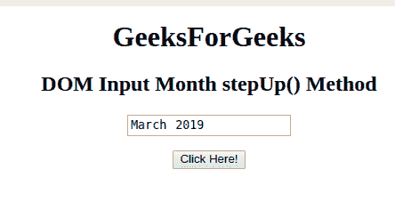
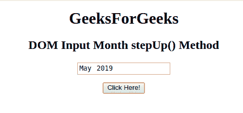

# HTML | DOM 输入月跨步()方法

> 原文:[https://www . geesforgeks . org/html-DOM-input-month-step-method/](https://www.geeksforgeeks.org/html-dom-input-month-stepup-method/)

HTML DOM 中的 **DOM 输入月步进()**方法用于将月字段的值增加给定的数字。这种方法只会增加月的价值，而不会增加年的价值。

**语法:**

```html
monthObject.stepUp(number)
```

**参数:**它接受一个单一且必需的参数:

*   **号**指定要增加的月数。默认情况下，月份会增加 1。

**返回值:**不返回值。

**示例:**本示例展示了 stepUp()方法的工作原理:

```html
<!DOCTYPE html> 
<html> 

<head> 
    <title> 
        HTML DOM Input Month stepUp() Method
    </title> 
</head> 

<body style="text-align:center;"> 

    <h1>GeeksForGeeks</h1> 

    <h2>DOM Input Month stepUp() Method</h2> 
            <form id="myGeeks">
    <input type="month" id="month_id" name="geeks" value="2019-03"> 
                 </form>
                 <br>
    <button onclick="myGeeks()">Click Here!</button> 

    <!-- Script to increment the month -->
    <script> 
        function myGeeks() { 
            document.getElementById("month_id").stepUp(2) ;
        } 
    </script> 
</body> 

</html>            

```

**输出:**
**点击按钮前:**


**点击按钮后:**


**支持的浏览器:**T2 DOM 输入法支持的浏览器如下:

*   谷歌 Chrome
*   Internet Explorer 10.0 +
*   歌剧
*   旅行队