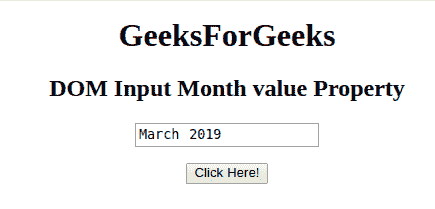
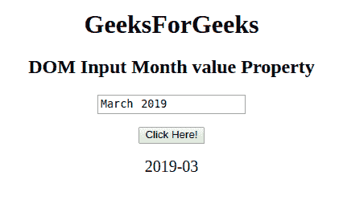
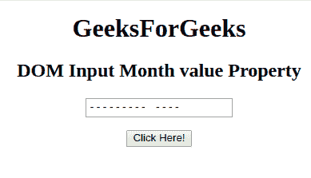
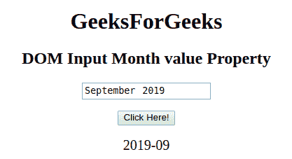

# HTML | DOM 输入月份值属性

> 原文:[https://www . geesforgeks . org/html-DOM-input-month-value-property/](https://www.geeksforgeeks.org/html-dom-input-month-value-property/)

**输入月份值**属性用于设置或返回月份字段的值属性的值。“输入月份”值属性可用于为“周”字段指定月份和年份。

**语法:**

*   用于返回值属性:

    ```html
    monthObject.value
    ```

*   用于设置值属性:

    ```html
    monthObject.value = YYYY-MM
    ```

**属性值:**

*   **YYYY-MM:** 该值表示年和月。这里 YYYY 是年份即 2019，MM 是月份即 03。

**返回值:**返回一个代表月字段值的字符串。

下面的程序说明了月值属性:
**示例-1:** 本示例返回输入月值属性。

```html
<!DOCTYPE html> 
<html> 

<head> 
    <title> 
        HTML DOM Input Month value Property
    </title> 
</head> 

<body style="text-align:center;"> 

    <h1>GeeksForGeeks</h1> 

    <h2>DOM Input Month value Property</h2> 
            <form id="myGeeks">
    <input type="month" id="month_id" name="geeks" value="2019-03"> 
                 </form>
                 <br>
    <button onclick="myGeeks()">Click Here!</button> 

    <p id="GFG" style="font-size:20px;"></p> 

    <!-- Script to return the value Property-->
    <script> 
        function myGeeks() { 
            var gfg = document.getElementById("month_id").value;
            document.getElementById("GFG").innerHTML = gfg;
        } 
    </script> 
</body> 

</html>                     
```

**输出**
**点击按钮前:**


**点击按钮后:**


**示例-2:** 本示例说明如何**设置**属性。

```html
<!DOCTYPE html> 
<html> 

<head> 
    <title> 
        HTML DOM Input Month value Property
    </title> 
</head> 

<body style="text-align:center;"> 

    <h1>GeeksForGeeks</h1> 

    <h2>DOM Input Month value Property</h2> 
            <form id="myGeeks">
    <input type="month" id="month_id" name="geeks" > 
                </form>
                <br>
    <button onclick="myGeeks()">Click Here!</button> 

    <p id="GFG" style="font-size:20px;"></p> 

    <!-- Script to set the value Property-->
    <script> 
        function myGeeks() { 
            var gfg = document.getElementById("month_id");
            gfg.value = "2019-09";
            var g =    gfg.value;        
            document.getElementById("GFG").innerHTML = g;
        } 
    </script> 
</body> 

</html>                    
```

**输出:**
**点击按钮前:**


**点击按钮后:**



**支持的浏览器:**T2 DOM 输入月值属性支持的浏览器如下:

*   谷歌 Chrome
*   Internet Explorer 10.0 +
*   火狐浏览器
*   歌剧
*   旅行队

**注意:**在 Firefox 中，输入 type="month "元素不显示任何日期字段或日历。