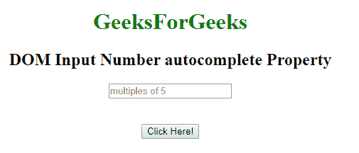
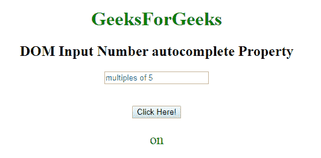
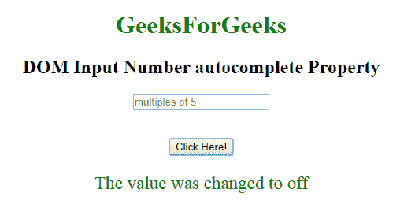

# HTML | DOM 输入数字自动完成属性

> 原文:[https://www . geesforgeks . org/html-DOM-input-number-autocomplete-property/](https://www.geeksforgeeks.org/html-dom-input-number-autocomplete-property/)

HTML DOM 中的**输入数字自动完成属性**用于设置或返回输入数字字段的自动完成属性的值。自动完成属性用于指定自动完成属性的值是“开”还是“关”。当“自动完成”属性设置为“开”时，浏览器将根据用户之前输入的值自动完成。

**语法:**

*   它返回输入数字自动完成属性。

    ```html
    number.autocomplete
    ```

*   它用于设置输入数字自动完成属性。

    ```html
    numberObject.autocomplete = "on | off" 
    ```

**属性值:**包含以下两个值:

*   **开:**为默认值。它会自动完成这些值。
*   **off:** 定义用户应填写 URL 输入字段的值。它不会自动完成这些值。

**返回值:**返回一个代表自动完成状态的字符串值。

**示例 1:** 本示例返回输入数字自动完成属性

```html
<!DOCTYPE html> 
<html> 

<head>
    <title>
        HTML DOM Input Number
        autocomplete Property
    </title>
</head>

<body style="text-align:center;"> 

    <h1 style="color:green;"> 
        GeeksForGeeks 
    </h1> 

    <h2>DOM Input Number autocomplete Property</h2> 

    <form id="myGeeks"> 
        <input type="number" id="myNumber" step="5"
                name="geeks" placeholder="multiples of 5"
                autocomplete="on"> 
    </form>

    <br><br> 

    <button onclick="myFunction()"> 
        Click Here! 
    </button> 

    <p id="demo" style="font-size:23px;color:green;"></p> 

    <script> 
        function myFunction() { 

            // Accessing input value 
            var x = 
            document.getElementById("myNumber").autocomplete;

            document.getElementById("demo").innerHTML = x;
        } 
    </script> 
</body> 

</html>
```

**输出:**

*   **点击按钮前:**
    
*   **点击按钮后:**
    

**示例 2:** 本示例设置输入数字自动完成属性。

```html
<!DOCTYPE html> 
<html> 

<head>
    <title>
        HTML DOM Input Number
        autocomplete Property
    </title>
</head>

<body style="text-align:center;"> 

    <h1 style="color:green;"> 
        GeeksForGeeks 
    </h1> 

    <h2>DOM Input Number autocomplete Property</h2> 

    <form id="myGeeks"> 
        <input type="number" id="myNumber" step="5"
            name="geeks" placeholder="multiples of 5"
            autocomplete="on"> 
    </form>

    <br><br> 

    <button onclick="myFunction()"> 
        Click Here! 
    </button> 

    <p id="demo" style="font-size:23px;color:green;"></p> 

    <script> 
        function myFunction() { 

            // Accessing input value 
            var x = document.getElementById(
                "myNumber").autocomplete ="off";                 

            document.getElementById("demo").innerHTML
                ="The value was changed to " + x;
        }
    </script>
</body> 

</html>
```

**输出:**

*   **点击按钮前:**
    
*   **点击按钮后:**
    

**支持的浏览器:****HTML DOM 输入数字自动完成属性**支持的浏览器如下:

*   谷歌 Chrome
*   微软公司出品的 web 浏览器
*   火狐浏览器
*   苹果 Safari
*   歌剧