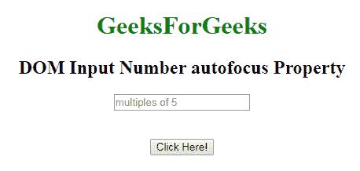
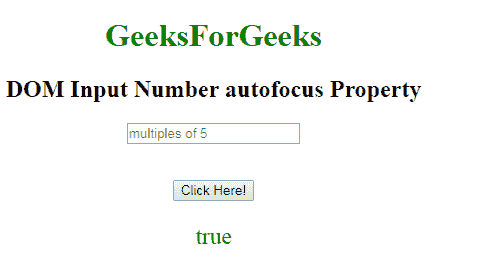
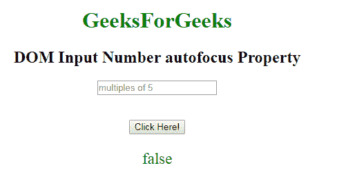

# HTML | DOM 输入编号自动对焦属性

> 原文:[https://www . geesforgeks . org/html-DOM-input-number-autofocus-property/](https://www.geeksforgeeks.org/html-dom-input-number-autofocus-property/)

HTML DOM 中的 **DOM 输入数字自动对焦属性**用于设置或返回页面加载时输入数字字段是否应该对焦。它反映了 HTML 自动对焦属性。
**语法:**

*   它返回自动对焦属性。

```html
numberObject.autofocus
```

*   它用于设置自动对焦属性。

```html
numberObject.autofocus = "true|false"
```

**房产价值:**

*   **true:** 设置数域焦点。
*   **假:**有默认值。它定义了数字字段不能获得焦点。

**返回值:**返回一个布尔值，代表数字字段是否自动对焦。
**示例-1:** 本示例返回输入数字自动对焦属性。

## 超文本标记语言

```html
<!DOCTYPE html>
<html>

    <body style="text-align:center;">

        <h1 style="color:green;">
            GeeksForGeeks
        </h1>

        <h2>DOM Input Number autofocus Property</h2>
             <form id="myGeeks">
        <input type="number"
            id="myNumber" step="5" name="geeks"
            placeholder="multiples of 5" autofocus>
            </form>    <br><br>
        <button onclick="myFunction()">
            Click Here!
        </button>

        <p id="demo" style="font-size:23px;color:green;"></p>

        <script>
            function myFunction() {

                // Accessing input value
                var x =
                document.getElementById("myNumber").autofocus;               
                document.getElementById("demo").innerHTML = x;
            }
        </script>

    </body>

</html>                   
```

**输出:**
**点击按钮前:**



**点击按钮后:**



**示例-2:** 本示例说明如何**设置**属性。

## 超文本标记语言

```html
<!DOCTYPE html>
<html>

    <body style="text-align:center;">

        <h1 style="color:green;">
            GeeksForGeeks
        </h1>

        <h2>DOM Input Number autofocus Property</h2>
             <form id="myGeeks">
        <input type="number"
            id="myNumber" step="5" name="geeks"
            placeholder="multiples of 5" autofocus>
            </form>    <br><br>
        <button onclick="myFunction()">
            Click Here!
        </button>

        <p id="demo" style="font-size:23px;color:green;"></p>

        <script>
            function myFunction() {

                // Accessing input value
                var x =
                document.getElementById("myNumber").autofocus = false;               
                document.getElementById("demo").innerHTML = x;
            }
        </script>

    </body>

</html>                   
```

**输出:**
**点击按钮前:**


**点击按钮后:**



**支持的浏览器:**T2 DOM 输入号自动对焦属性支持的浏览器如下:

*   谷歌 Chrome
*   Internet Explorer 10.0 +
*   火狐浏览器
*   歌剧
*   旅行队