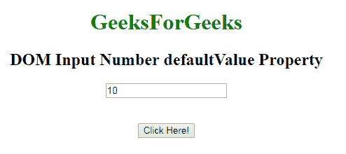
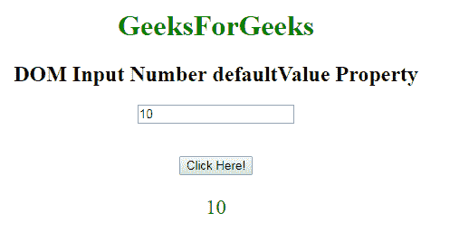
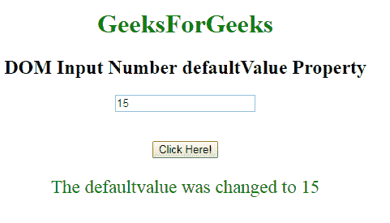

# HTML | DOM 输入数字默认值属性

> 原文:[https://www . geesforgeks . org/html-DOM-input-number-defaultvalue-property/](https://www.geeksforgeeks.org/html-dom-input-number-defaultvalue-property/)

HTML DOM 中的 **DOM 输入数字默认值属性**用于设置或返回数字字段的默认值。此属性用于反映 HTML 值属性。默认值与值的主要区别在于，默认值表示默认值，值包含一些更改后的当前值。此属性对于确定数字字段是否已更改非常有用。

**语法:**

*   它返回 defaultValue 属性。

```html
numberObject.defaultValue
```

*   它用于设置 defaultValue 属性。

```html
numberObject.defaultValue = value
```

**属性值:**包含定义数字字段默认值的单个属性值。
**返回值:**返回一个代表数字字段默认值的字符串值。
**示例-1:** 本示例说明如何**返回**输入数字默认值属性。

## 超文本标记语言

```html
<!DOCTYPE html>
<html>

    <body style="text-align:center;">

        <h1 style="color:green;">
            GeeksForGeeks
        </h1>

        <h2>DOM Input Number defaultValue Property</h2>
             <form id="myGeeks">
        <input type="number"
            id="myNumber" step="5" name="geeks"
            placeholder="multiples of 5" value="10">
            </form>    <br><br>
        <button onclick="myFunction()">
            Click Here!
        </button>

        <p id="demo" style="font-size:23px;color:green;"></p>

        <script>
            function myFunction() {

                // Accessing input value
                var x =
                document.getElementById("myNumber").defaultValue;               
                document.getElementById("demo").innerHTML = x;
            }
        </script>

    </body>

</html>                   
```

**输出:**
**点击按钮前:**



**点击按钮后:**



**示例-2 :** 本示例说明如何**返回**输入数字默认值属性。

## 超文本标记语言

```html
<!DOCTYPE html>
<html>

    <body style="text-align:center;">

        <h1 style="color:green;">
            GeeksForGeeks
        </h1>

        <h2>DOM Input Number defaultValue Property</h2>
             <form id="myGeeks">
        <input type="number"
            id="myNumber" step="5" name="geeks"
            placeholder="multiples of 5" value="10">
            </form>    <br><br>
        <button onclick="myFunction()">
            Click Here!
        </button>

        <p id="demo" style="font-size:23px;color:green;"></p>

        <script>
            function myFunction() {

                // Accessing input value
                var x =
                document.getElementById("myNumber").defaultValue = "15";               
                document.getElementById("demo").innerHTML =
                "The defaultvalue was changed to " + x;
            }
        </script>

    </body>

</html>                   
```

**输出:**
**点击按钮前:**


**点击按钮后:**



**支持的浏览器:**T2 DOM 输入号默认值属性支持的浏览器如下:

*   谷歌 Chrome
*   Internet Explorer 10.0 +
*   火狐浏览器
*   歌剧
*   旅行队