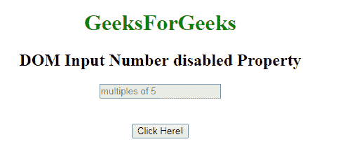
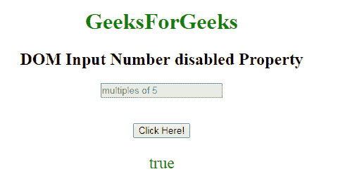
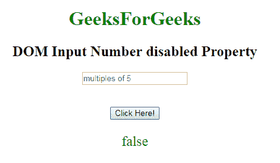

# HTML | DOM 输入号码禁用属性

> 原文:[https://www . geesforgeks . org/html-DOM-input-number-disabled-property/](https://www.geeksforgeeks.org/html-dom-input-number-disabled-property/)

HTML DOM 中的 **DOM 输入数字禁用属性**用于返回一个布尔值，该值表示数字字段是否应被禁用。
默认情况下，禁用的元素以灰色显示，不可用且不可点击。

**语法:**

*   它返回禁用的属性。

    ```html
    numberObject.disabled
    ```

*   它用于设置禁用属性。

    ```html
    numberObject.disabled = true
    ```

**属性值:**

*   **true:** 指定禁用数字字段。
*   **false:** 指定数字字段未禁用。

**默认值:**假

**返回值:**返回布尔值，即如果数字字段被禁用，则为真；如果数字字段未被禁用，则为假。

**示例-1:** 本示例返回禁用属性的值。

```html
<!DOCTYPE html> 
<html> 

    <body style="text-align:center;"> 

        <h1 style="color:green;"> 
            GeeksForGeeks 
        </h1> 

        <h2>DOM Input Number disabled Property</h2> 
             <form id="myGeeks">
        <input type="number"
            id="myNumber" step="5" name="geeks"
            placeholder="multiples of 5"  disabled> 
            </form>    <br><br>
        <button onclick="myFunction()"> 
            Click Here! 
        </button> 

        <p id="demo" style="font-size:23px;color:green;"></p> 

        <script> 
            function myFunction() { 

                // Accessing input value 
                var x = 
                document.getElementById("myNumber").disabled;
                document.getElementById("demo").innerHTML = x; 
            } 
        </script> 

    </body> 

</html>                    
```

**输出:**
**点击按钮前:**

**点击按钮后:**

**示例-2:** 本示例说明如何**设置**属性。

```html
<!DOCTYPE html> 
<html> 

    <body style="text-align:center;"> 

        <h1 style="color:green;"> 
            GeeksForGeeks 
        </h1> 

        <h2>DOM Input Number disabled Property</h2> 
             <form id="myGeeks">
        <input type="number"
            id="myNumber" step="5" name="geeks"
            placeholder="multiples of 5"  disabled> 
            </form>    <br><br>
        <button onclick="myFunction()"> 
            Click Here! 
        </button> 

        <p id="demo" style="font-size:23px;color:green;"></p> 

        <script> 
            function myFunction() { 

                // Accessing input value 
                var x = 
                document.getElementById("myNumber").disabled = false;
                document.getElementById("demo").innerHTML = x; 
            } 
        </script> 

    </body> 

</html>                    
```

**输出:**
**点击按钮前:**

**点击按钮后:**


**支持的浏览器:**禁用属性的 **DOM 输入号支持的浏览器如下:**

*   谷歌 Chrome
*   Internet Explorer 10.0 +
*   火狐浏览器
*   歌剧
*   旅行队