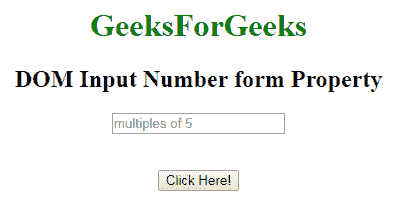
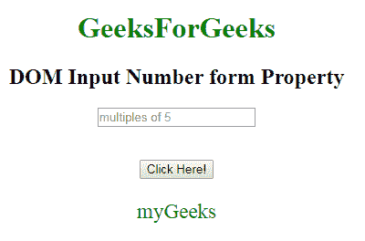

# HTML | DOM 输入数字表单属性

> 原文:[https://www . geesforgeks . org/html-DOM-input-number-form-property/](https://www.geeksforgeeks.org/html-dom-input-number-form-property/)

HTML 中的 **DOM 输入数字表单属性**用于返回包含输入数字字段的表单的引用。它是一个只读属性，在成功时返回一个表单对象。
**语法:**

```html
numberObject.form 
```

**返回值:**它返回一个字符串值，该值指定包含输入数字字段的表单的引用。

**示例:**下面的程序说明了输入数字表单属性。

## 超文本标记语言

```html
<!DOCTYPE html>
<html>

    <body style="text-align:center;">

        <h1 style="color:green;">
            GeeksForGeeks
        </h1>

        <h2>DOM Input Number form Property</h2>
             <form id="myGeeks">
        <input type="number"
            id="myNumber" step="5" name="geeks"
            placeholder="multiples of 5"  >
            </form>    <br><br>
        <button onclick="myFunction()">
            Click Here!
        </button>

        <p id="demo" style="font-size:23px;color:green;"></p>

        <script>
            function myFunction() {

                // Accessing input value
                var x =
                document.getElementById("myNumber").form.id;
                document.getElementById(
                "demo").innerHTML = x;
            }
        </script>

    </body>

</html>                   
```

**输出:**
**点击按钮前:**



**点击按钮后:**



**支持的浏览器:**T2 DOM 输入数字表单属性支持的浏览器如下:

*   谷歌 Chrome
*   微软公司出品的 web 浏览器
*   火狐浏览器
*   歌剧
*   旅行队