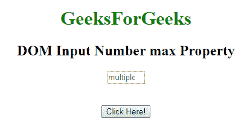
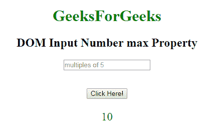
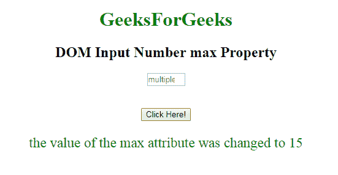

# HTML | DOM 输入数量最大属性

> 原文:[https://www . geesforgeks . org/html-DOM-input-number-max-property/](https://www.geeksforgeeks.org/html-dom-input-number-max-property/)

HTML DOM 中的 **DOM 输入数字最大属性**用于设置或返回数字字段的最大属性值。**最大属性**定义了数字字段的最大值。
**语法:**

*   它返回 max 属性。

```html
numberObject.max
```

*   它用于设置 max 属性。

```html
numberObject.max = number
```

**属性值:**它包含一个单一的值，即**数字**，该数字指定了允许用户为数字字段输入的最大值。
**返回值:**返回一个数值，代表一个数字字段允许的最大数值。
**示例-1:** 本示例说明如何**返回**输入数字 max 属性。

## 超文本标记语言

```html
<!DOCTYPE html>
<html>

    <body style="text-align:center;">

        <h1 style="color:green;">
            GeeksForGeeks
        </h1>

        <h2>DOM Input Number max Property</h2>
             <form id="myGeeks">
        <input type="number"
            id="myNumber" step="5" name="geeks"
            placeholder="multiples of 5" max="10">
            </form>    <br><br>
        <button onclick="myFunction()">
            Click Here!
        </button>

        <p id="demo" style="font-size:23px;color:green;"></p>

        <script>
            function myFunction() {

                // Accessing input value
                var x =
                document.getElementById("myNumber").max;               
                document.getElementById("demo").innerHTML = x;
            }
        </script>

    </body>

</html>                   
```

**输出:**
**点击按钮前:**



**点击按钮后:**



**示例-2:** 本示例说明如何**设置**输入数字最大属性。

## 超文本标记语言

```html
<!DOCTYPE html>
<html>

    <body style="text-align:center;">

        <h1 style="color:green;">
            GeeksForGeeks
        </h1>

        <h2>DOM Input Number max Property</h2>
             <form id="myGeeks">
        <input type="number"
            id="myNumber" step="5" name="geeks"
            placeholder="multiples of 5" max="10">
            </form>    <br><br>
        <button onclick="myFunction()">
            Click Here!
        </button>

        <p id="demo" style="font-size:23px;color:green;"></p>

        <script>
            function myFunction() {

                // Accessing input value
                var x =
                document.getElementById("myNumber").max = 15;               
                document.getElementById("demo").innerHTML =
               "the value of the max attribute was changed to " + x;
            }
        </script>

    </body>

</html>                   
```

**输出:**
**点击按钮前:**


**点击按钮后:**



**支持的浏览器:**T2 DOM 输入号 max Property 支持的浏览器如下:

*   谷歌 Chrome
*   Internet Explorer 10.0 +
*   火狐浏览器
*   歌剧
*   旅行队