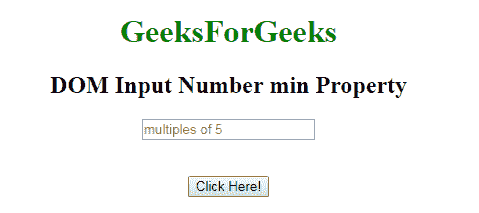
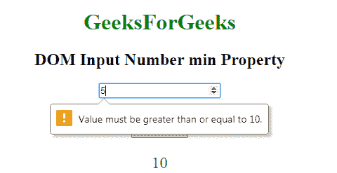
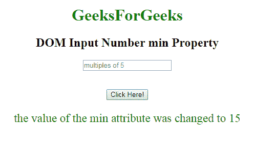

# HTML | DOM 输入数量最小属性

> 原文:[https://www . geesforgeks . org/html-DOM-input-number-min-property/](https://www.geeksforgeeks.org/html-dom-input-number-min-property/)

**DOM 输入数字最小属性**用于设置或返回数字字段的最小属性值。**最小属性**定义输入数字字段的最小值。

**语法:**

*   它返回 min 属性。

    ```html
    numberObject.min
    ```

*   它用于设置 min 属性。

    ```html
    numberObject.min = number
    ```

**属性值:**它包含一个单一的值，即**数字**，该数字指定了允许用户为数字字段输入的最小值。

**返回值:**返回一个字符串值，代表一个数字字段允许的最小数字。

**示例-1:** 本示例说明如何**返回**输入数字最小属性。

```html
<!DOCTYPE html> 
<html> 

    <body style="text-align:center;"> 

        <h1 style="color:green;"> 
            GeeksForGeeks 
        </h1> 

        <h2>DOM Input Number min Property</h2> 
             <form id="myGeeks">
        <input type="number"
            id="myNumber" step="5" name="geeks"
            placeholder="multiples of 5" min="10"> 
            </form>    <br><br>
        <button onclick="myFunction()"> 
            Click Here! 
        </button> 

        <p id="demo" style="font-size:23px;color:green;"></p> 

        <script> 
            function myFunction() { 

                // Accessing input value 
                var x = 
                document.getElementById("myNumber").min;                
                document.getElementById("demo").innerHTML = x; 
            } 
        </script> 

    </body> 

</html>                    
```

**输出:**
**点击按钮前:**

**点击按钮后:**

**示例-2 :** 本示例说明了如何**设置**输入数字 min Property。

```html
<!DOCTYPE html> 
<html> 

    <body style="text-align:center;"> 

        <h1 style="color:green;"> 
            GeeksForGeeks 
        </h1> 

        <h2>DOM Input Number min Property</h2> 
             <form id="myGeeks">
        <input type="number"
            id="myNumber" step="5" name="geeks"
            placeholder="multiples of 5" min="10"> 
            </form>    <br><br>
        <button onclick="myFunction()"> 
            Click Here! 
        </button> 

        <p id="demo" style="font-size:23px;color:green;"></p> 

        <script> 
            function myFunction() { 

                // Accessing input value 
                var x = 
                document.getElementById("myNumber").min = 15;                
                document.getElementById("demo").innerHTML =
              "the value of the min attribute was changed to " +  x; 
            } 
        </script> 

    </body> 

</html>                    
```

**输出:**
**点击按钮前:**

**点击按钮后:**

**支持的浏览器:**支持的浏览器由 **DOM 输入数量 min Property** 列出如下:

*   谷歌 Chrome
*   Internet Explorer 10.0 +
*   火狐浏览器
*   歌剧
*   旅行队