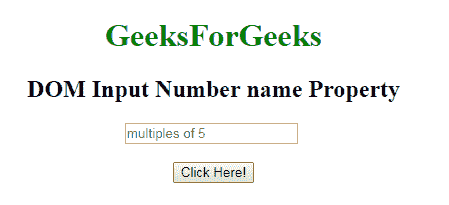
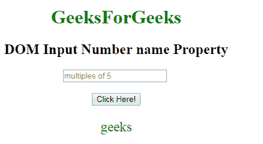
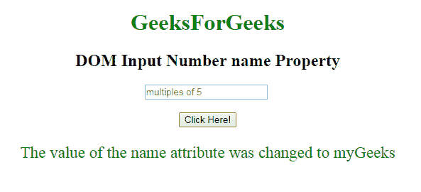

# HTML | DOM 输入数字名称属性

> 原文:[https://www . geesforgeks . org/html-DOM-input-number-name-property/](https://www.geeksforgeeks.org/html-dom-input-number-name-property/)

HTML DOM 中的 **DOM 输入数字名称属性**用于设置或返回数字字段的名称属性值。每个输入字段都需要名称属性。如果没有在输入字段中指定 name 属性，则根本不会发送该字段的数据。

**语法:**

*   它返回输入数字名称属性。

    ```html
    numberObject.name
    ```

*   它用于设置输入号码名称属性。

    ```html
    numberObject.name = name
    ```

**属性值:**包含定义数字字段名称的单个值名称。

**返回值:**返回一个代表数字字段名称的字符串值。

**示例-1:** 本示例说明如何返回 Input 数字名称属性。

```html
<!DOCTYPE html> 
<html> 

    <body style="text-align:center;"> 

        <h1 style="color:green;"> 
            GeeksForGeeks 
        </h1> 

        <h2>DOM Input Number name Property</h2> 

        <input type="number"
            id="myNumber" step="5" name="geeks"
            placeholder="multiples of 5"  > <br><br>
        <button onclick="myFunction()"> 
            Click Here! 
        </button> 

        <p id="demo" style="font-size:23px;color:green;"></p> 

        <script> 
            function myFunction() { 

                // Accessing input value 
                var x = 
                document.getElementById("myNumber").name;
                document.getElementById("demo").innerHTML = x; 
            } 
        </script> 

    </body> 

</html>                    
```

**输出:**
**点击按钮前:**

**点击按钮后:**

**示例-2 :** 本示例说明如何**设置**输入号码名称属性。

```html
<!DOCTYPE html> 
<html> 

    <body style="text-align:center;"> 

        <h1 style="color:green;"> 
            GeeksForGeeks 
        </h1> 

        <h2>DOM Input Number name Property</h2> 

        <input type="number"
            id="myNumber" step="5" name="geeks"
            placeholder="multiples of 5"  > <br><br>
        <button onclick="myFunction()"> 
            Click Here! 
        </button> 

        <p id="demo" style="font-size:23px;color:green;"></p> 

        <script> 
            function myFunction() { 

                // Accessing input value 
                var x = 
                document.getElementById("myNumber").name = "myGeeks";
                document.getElementById("demo").innerHTML = 
               "The value of the name attribute was changed to " + x; 
            } 
        </script> 

    </body> 

</html>                    
```

**输出:**
**点击按钮前:**

**点击按钮后:**


**支持的浏览器:****DOM 输入数字名称属性**支持的浏览器如下:

*   谷歌 Chrome
*   Internet Explorer 10.0 +
*   火狐浏览器
*   歌剧
*   旅行队