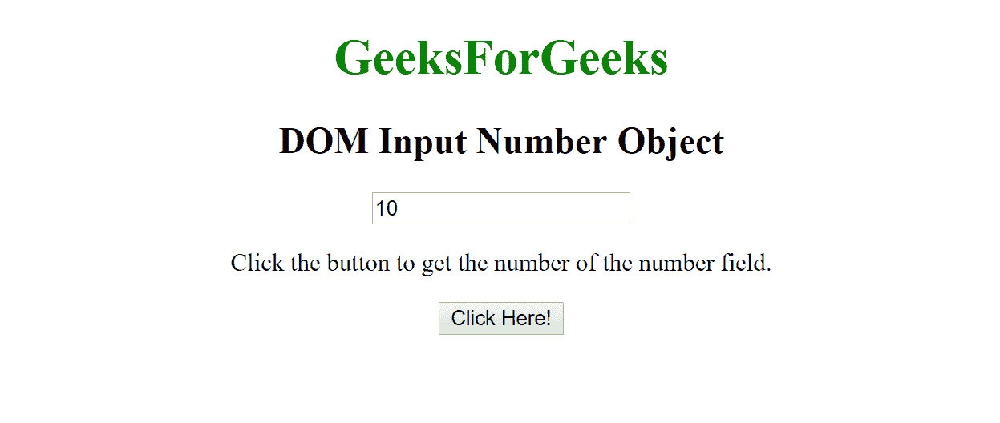
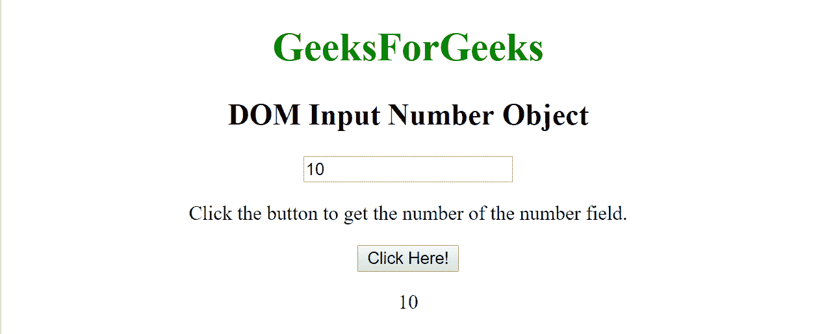
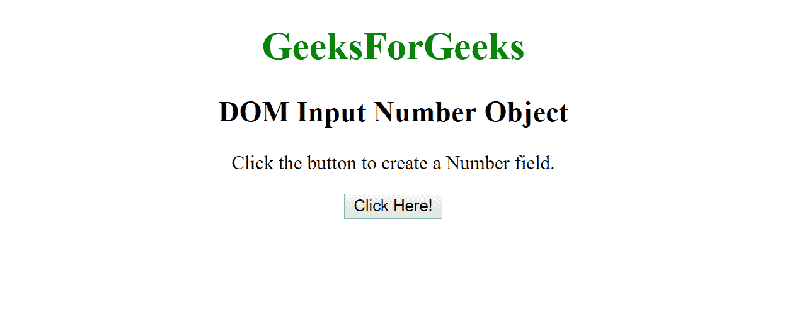
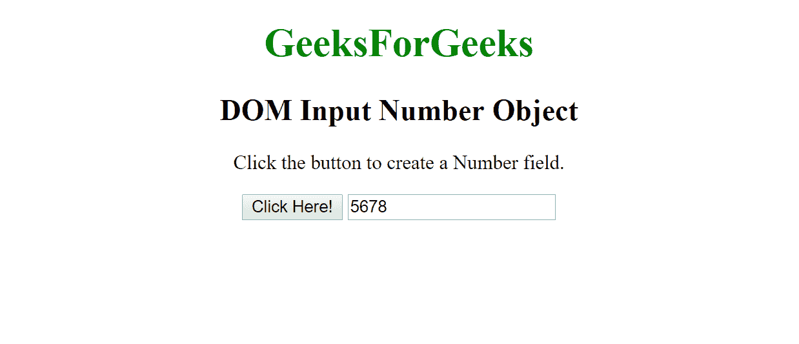

# HTML | DOM 输入数字对象

> 原文:[https://www.geeksforgeeks.org/html-dom-input-number-object/](https://www.geeksforgeeks.org/html-dom-input-number-object/)

HTML DOM 中的**输入数字对象**用于表示带有**类型=“数字”**的 HTML 输入元素。
使用 **getElementById()方法**可以访问 **type= "number"** 的输入元素。

**语法:**

*   用于访问输入的数字对象。

    ```html
    document.getElementById("id");
    ```

*   用于创建输入元素

    ```html
    document.createElement("input");
    ```

**输入数字对象属性:**

| 财产 | 描述 |
| 类型 | 此属性用于返回数字字段是哪种类型的表单元素。 |
| 价值 | 此属性用于设置或返回数字字段的值属性的值。 |
| 自动完成 | 此属性用于设置或返回数字字段的自动完成属性的值。 |
| 自（动）调焦装置 | 此属性用于设置或返回页面加载时数字字段是否应自动获得焦点。 |
| 缺省值 | 此属性用于设置或返回数字字段的默认值。 |
| 有缺陷的 | 此属性用于设置或返回数字字段是否被禁用。 |
| 形式 | 此属性用于返回对包含数字字段的表单的引用。 |
| 目录 | 此属性用于返回对包含数字字段的数据列表的引用。 |
| 最大 | 此属性用于设置或返回数字字段的 max 属性值。 |
| 部 | 此属性用于设置或返回数字字段的 min 属性值。 |
| 名字 | 此属性用于设置或返回数字字段的名称属性值。 |
| 占位符 | 此属性用于设置或返回数字字段的占位符属性值。 |
| 只读的 | 此属性用于设置或返回数字字段是否为只读。 |
| 需要 | 此属性用于设置或返回在提交表单之前是否必须填写数字字段。 |
| 步骤 | 此属性用于设置或返回数字字段的步长属性值。 |

**输入数字对象方法:**

| 方法 | 描述 |
| 逐步下降() | 此方法用于将输入数字的值减少指定的数字。 |
| stepUp() | 此方法用于将输入数字的值增加指定的数字。 |

**示例-1:**

```html
<!DOCTYPE html>
<html>

    <body style="text-align:center;">

        <h1 style="color:green;">  
            GeeksForGeeks  
        </h1>

        <h2>DOM Input Number Object</h2>

        <input type="number" 
               id="myNumber" 
               value="10">

        <p>Click the button to get the
          number of the number field.</p>

        <button onclick="myFunction()">
            Click Here!
        </button>

        <p id="demo"></p>

        <script>
            function myFunction() {

                // Accessining input value
                var x = 
                 document.getElementById("myNumber").value;
                document.getElementById(
                  "demo").innerHTML = x;
            }
        </script>

    </body>

</html>
```

**输出:**

**之前点击按钮:**


**点击按钮后:**


**示例-2:**

```html
<!DOCTYPE html>
<html>

<body style="text-align:center;">

    <h1 style="color:green;">  
            GeeksForGeeks  
        </h1>

    <h2>DOM Input Number Object</h2>

    <p>Click the button to create a Number field.</p>

    <button onclick="myFunction()">Click Here!</button>

    <script>
        function myFunction() {

            // Creating input element.
            var x = document.createElement("INPUT");
            x.setAttribute("type", "number");
            x.setAttribute("value", "5678");
            document.body.appendChild(x);
        }
    </script>

</body>

</html>
```

**输出:**

**之前点击按钮:**


**点击按钮后:**


**注意:** *<输入>元素*带 *type="number"* 在 **Internet Explorer 9+版本**中支持。

**支持的浏览器:**

*   谷歌 Chrome
*   Mozilla Firefox
*   边缘
*   旅行队
*   歌剧