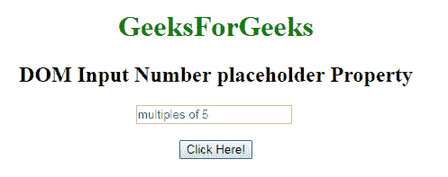
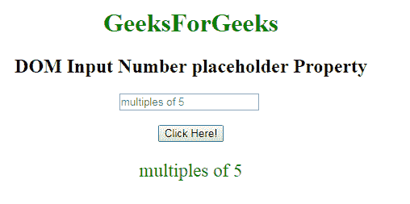
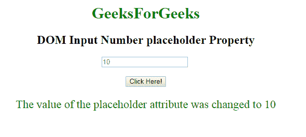

# HTML | DOM 输入数字占位符属性

> 原文:[https://www . geesforgeks . org/html-DOM-input-number-placeholder-property/](https://www.geeksforgeeks.org/html-dom-input-number-placeholder-property/)

HTML DOM 中的 **DOM 输入数字占位符属性**用于设置或返回数字字段的占位符属性的值。占位符属性指定描述输入字段预期值的简短提示。在用户输入值之前，短提示会显示在字段中。

**语法:**

*   它返回输入数字占位符属性。

    ```html
    numberObject.placeholder
    ```

*   它用于设置输入号码占位符属性。

    ```html
    numberObject.placeholder = text
    ```

**属性值:**它包含单值文本，用于定义描述数字字段预期值的简短提示。

**返回值:**它返回一个字符串值，该值表示描述数字字段预期值的简短提示。

**示例 1:** 本示例说明如何返回输入数字占位符属性。

```html
<!DOCTYPE html> 
<html> 

    <body style="text-align:center;"> 

        <h1 style="color:green;"> 
            GeeksForGeeks 
        </h1> 

        <h2>DOM Input Number placeholder Property</h2> 

        <input type="number"
            id="myNumber" step="5"
            placeholder="multiples of 5" > <br><br>
        <button onclick="myFunction()"> 
            Click Here! 
        </button> 

        <p id="demo" style="font-size:23px;color:green;"></p> 

        <script> 
            function myFunction() { 

                // Accessing input value 
                var x = 
                document.getElementById("myNumber").placeholder; 
                document.getElementById("demo").innerHTML =  x; 
            } 
        </script> 

    </body> 

</html> 
```

**输出:**
**点击按钮前:**

**点击按钮后:**

**示例-2:** 本示例说明如何**设置**输入数字占位符属性。

```html
<!DOCTYPE html> 
<html> 

    <body style="text-align:center;"> 

        <h1 style="color:green;"> 
            GeeksForGeeks 
        </h1> 

        <h2>DOM Input Number placeholder Property</h2> 

        <input type="number"
            id="myNumber" step="5"
            placeholder="multiples of 5" > <br><br>
        <button onclick="myFunction()"> 
            Click Here! 
        </button> 

        <p id="demo" style="font-size:23px;color:green;"></p> 

        <script> 
            function myFunction() { 

                // Accessing input value 
                var x = 
                document.getElementById("myNumber").placeholder = "10"; 
                document.getElementById("demo").innerHTML =  
               "The value of the placeholder attribute was changed to " + x; 
            } 
        </script> 

    </body> 

</html> 
```

**输出:**
**点击按钮前:**

**点击按钮后:**


**支持的浏览器:****DOM 输入号码 placeholderProperty** 支持的浏览器如下:

*   谷歌 Chrome
*   Internet Explorer 10.0 +
*   火狐浏览器
*   歌剧
*   旅行队