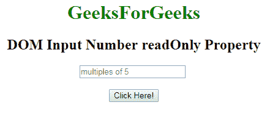
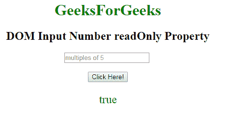
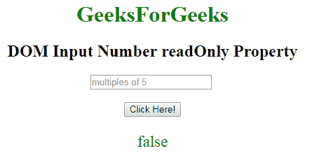

# HTML | DOM 输入数字只读属性

> 原文:[https://www . geesforgeks . org/html-DOM-input-number-readonly-property/](https://www.geeksforgeeks.org/html-dom-input-number-readonly-property/)

**DOM 输入数字只读属性**用于设置或返回数字字段是否应为只读。这意味着用户不能修改或更改特定元素中已经存在的内容(但是，用户可以定位到它，突出显示它，并从中复制文本)，而 JavaScript 可以用于更改只读值并使输入字段可编辑。

**语法**:

*   它用于返回 readOnly 属性。

    ```html
    numberObject.readOnly
    ```

*   它用于设置只读属性。

    ```html
    numberObject.readOnly = true|false
    ```

**属性值:**

*   **true:** 定义数字字段为只读。
*   **false:** 为默认值。它定义了数字字段不是只读的。

**返回值:**返回一个布尔值，表示数字字段是否为只读。

**示例-1:** 这个示例说明了如何返回属性。

```html
<!DOCTYPE html> 
<html> 

    <body style="text-align:center;"> 

        <h1 style="color:green;"> 
            GeeksForGeeks 
        </h1> 

        <h2>DOM Input Number readOnly Property</h2> 

        <input type="number"
            id="myNumber" step="5"
            placeholder="multiples of 5"  readonly> <br><br>
        <button onclick="myFunction()"> 
            Click Here! 
        </button> 

        <p id="demo" style="font-size:23px;color:green;"></p> 

        <script> 
            function myFunction() { 

                // Accessing input value 
                var x = 
                document.getElementById("myNumber").readOnly; 
                document.getElementById( 
                "demo").innerHTML = x; 
            } 
        </script> 

    </body> 

</html>                    
```

**输出:**
**点击按钮前:**

**点击按钮后:**


**示例-2:** 本示例说明如何设置属性。

```html
<!DOCTYPE html> 
<html> 

    <body style="text-align:center;"> 

        <h1 style="color:green;"> 
            GeeksForGeeks 
        </h1> 

        <h2>DOM Input Number readOnly Property</h2> 

        <input type="number"
            id="myNumber" step="5"
            placeholder="multiples of 5"  readonly> <br><br>
        <button onclick="myFunction()"> 
            Click Here! 
        </button> 

        <p id="demo" style="font-size:23px;color:green;"></p> 

        <script> 
            function myFunction() { 

                // Accessing input value 
                var x = 
                document.getElementById("myNumber").readOnly = false; 
                document.getElementById("demo").innerHTML = x; 
            } 
        </script> 

    </body> 

</html>                    
```

**输出:**
**点击按钮前:**

**点击按钮后:**


**支持的浏览器:**T2 DOM 输入数字只读属性支持的浏览器如下:

*   谷歌 Chrome
*   Internet Explorer 10.0 +
*   火狐浏览器
*   歌剧
*   旅行队