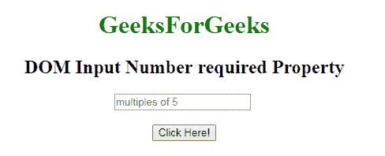
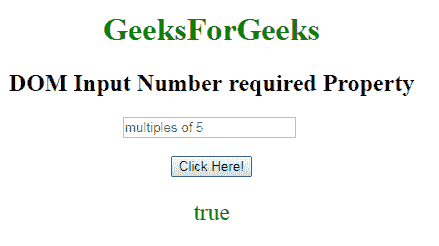
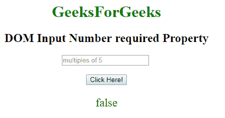

# HTML | DOM 输入数字必需属性

> 原文:[https://www . geesforgeks . org/html-DOM-input-number-required-property/](https://www.geeksforgeeks.org/html-dom-input-number-required-property/)

HTML DOM 中的 **DOM 需要输入数字属性**用于设置或返回提交表单时是否需要填写输入数字字段。此属性用于反映 HTML 必需的属性。

**语法:**

*   它返回需要输入数字的属性。

    ```html
    numberObject.required
    ```

*   It is used to set the Input number required property.

    ```html
    numberObject.required = true|false
    ```

    **属性值:**

    *   **true:** 指定提交表单前必须填写数字字段。
    *   **false:** 为默认值。它指定在提交表单之前不得填写数字字段。

    **返回值:**返回一个布尔值，表示在提交表单之前必须填写或不填写数字字段。

    **示例 1:** 本示例说明如何返回 Input number required 属性。

    ```html
    <DOCTYPE html> 
    <html> 

        <body style="text-align:center;"> 

            <h1 style="color:green;"> 
                GeeksForGeeks 
            </h1> 

            <h2>DOM Input Number required Property</h2> 

            <input type="number"
                id="myNumber" step="5"
                placeholder="multiples of 5"  required> <br><br>
            <button onclick="myFunction()"> 
                Click Here! 
            </button> 

            <p id="demo" style="font-size:23px;color:green;"></p> 

            <script> 
                function myFunction() { 

                    // Accessing input value 
                    var x = 
                    document.getElementById("myNumber").required; 
                    document.getElementById("demo").innerHTML = x; 
                } 
            </script> 

        </body> 

    </html>                    
    ```

    **输出:**
    **点击按钮前:**
    
    **点击按钮后:**
    
    **示例-2:** 本示例说明如何设置输入数字所需的属性。

    ```html
    <DOCTYPE html> 
    <html> 

        <body style="text-align:center;"> 

            <h1 style="color:green;"> 
                GeeksForGeeks 
            </h1> 

            <h2>DOM Input Number required Property</h2> 

            <input type="number"
                id="myNumber" step="5"
                placeholder="multiples of 5"  required> <br><br>
            <button onclick="myFunction()"> 
                Click Here! 
            </button> 

            <p id="demo" style="font-size:23px;color:green;"></p> 

            <script> 
                function myFunction() { 

                    // Accessing input value 
                    var x = 
                    document.getElementById("myNumber").required = false; 
                    document.getElementById("demo").innerHTML = x; 
                } 
            </script> 

        </body> 

    </html>                    
    ```

    **输出:**

    **点击按钮前:**
    
    **点击按钮后:**
    

    **支持的浏览器:**支持的浏览器 **DOM 输入数字所需属性**如下:

    *   谷歌 Chrome
    *   Internet Explorer 10.0 +
    *   火狐浏览器
    *   歌剧
    *   旅行队