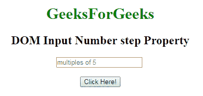
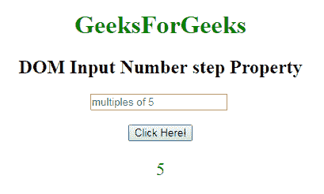
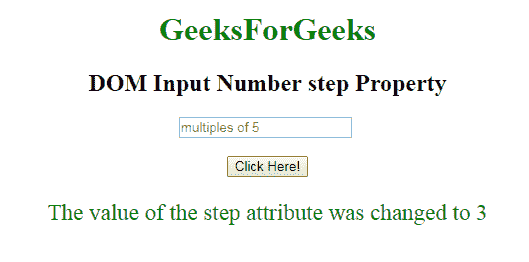

# HTML | DOM 输入数字步骤属性

> 原文:[https://www . geesforgeks . org/html-DOM-input-number-step-property/](https://www.geeksforgeeks.org/html-dom-input-number-step-property/)

**DOM 输入数字步长属性**用于设置或返回数字字段的步长属性值。HTML 中的 step 属性用于设置元素的离散步长。数字输入的默认步进值为 1。步长属性可以与最小值和最大值属性一起使用来创建合法值。
**语法:**

*   它返回 step 属性。

```html
numberObject.step
```

*   它用于设置 step 属性。

```html
numberObject.step = number
```

**属性值:**它包含一个值，即**数字**，指定数字字段的合法数字间隔。它的默认值是 1。
返回值:返回一个数值，代表数字字段的合法数字区间。
**示例-1:** 本示例说明如何**返回**属性。

## 超文本标记语言

```html
<!DOCTYPE html>
<html>

    <body style="text-align:center;">

        <h1 style="color:green;">
            GeeksForGeeks
        </h1>

        <h2>DOM Input Number step Property</h2>

        <input type="number"
            id="myNumber" step="5"
            placeholder="multiples of 5" > <br><br>
        <button onclick="myFunction()">
            Click Here!
        </button>

        <p id="demo" style="font-size:23px;color:green;"></p>

        <script>
            function myFunction() {

                // Accessing input value
                var x =
                document.getElementById("myNumber").step;
                document.getElementById("demo").innerHTML = x;
            }
        </script>

    </body>

</html>
```

**输出:**
**点击按钮前:**



**点击按钮后:**



**示例-2 :** 本示例说明如何**设置**属性。

## 超文本标记语言

```html
<!DOCTYPE html>
<html>

    <body style="text-align:center;">

        <h1 style="color:green;">
            GeeksForGeeks
        </h1>

        <h2>DOM Input Number step Property</h2>

        <input type="number"
            id="myNumber" step="5"
            placeholder="multiples of 5" > <br><br>
        <button onclick="myFunction()">
            Click Here!
        </button>

        <p id="demo" style="font-size:23px;color:green;"></p>

        <script>
            function myFunction() {

                // Accessing input value
                var x =
                document.getElementById("myNumber").step = "3";
                document.getElementById("demo").innerHTML = 
                "The value of the step attribute was changed to " + x;
            }
        </script>

    </body>

</html>
```

**输出:**
**点击按钮前:**


**点击按钮后:**



**支持的浏览器:****DOM 输入数字步长属性**支持的浏览器如下:

*   谷歌 Chrome
*   Internet Explorer 10.0 +
*   火狐浏览器
*   歌剧
*   旅行队