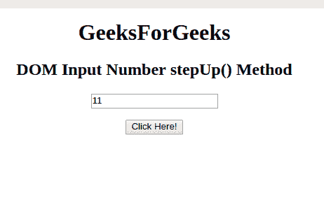
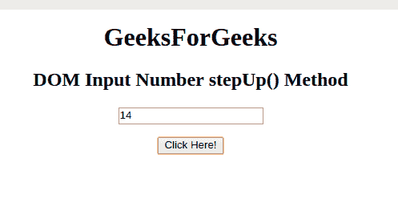

# HTML | DOM 输入数字 stepUp()方法

> 原文:[https://www . geesforgeks . org/html-DOM-input-number-step-method/](https://www.geeksforgeeks.org/html-dom-input-number-stepup-method/)

HTML DOM 中的 **DOM 输入数字步长()方法**用于*将数字字段的值增加给定值*。

**语法:**

```html
numberObject.stepUp(number)
```

**参数:**它接受一个单一且必需的参数:

*   **数字**:指定数字字段要增加的数字。默认情况下，它会增加 1。

**返回值:**不返回值。

**示例:**本示例展示了 stepUp()方法的工作原理:

```html
<!DOCTYPE html>
<html>

<head>
    <title>
        HTML DOM Input Number stepUp() Method
    </title>
</head>

<body style="text-align:center;">

    <h1>
      GeeksForGeeks
  </h1>

    <h2>
      DOM Input Number stepUp() Method
  </h2>
    <form id="myGeeks">
        <input type="number" 
               id="number_id" 
               name="geeks" 
               value="11">
    </form>
    <br>
    <button onclick="myGeeks()">
      Click Here!
  </button>

    <!-- Script to increment the number -->
    <script>
        function myGeeks() {
            document.getElementById(
              "number_id").stepUp(3);
        }
    </script>
</body>

</html>
```

**输出:**
**点击按钮前:**


**点击按钮后:**


**支持的浏览器:**DOM 输入 Number stepUp()方法支持的浏览器如下:

*   谷歌 Chrome
*   Internet Explorer 10.0 +
*   歌剧
*   旅行队