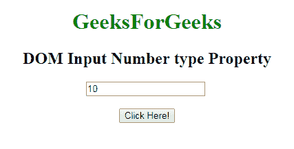
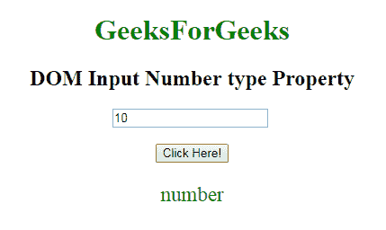

# HTML | DOM 输入数字类型属性

> 原文:[https://www . geesforgeks . org/html-DOM-input-number-type-property/](https://www.geeksforgeeks.org/html-dom-input-number-type-property/)

HTML DOM 中的 **DOM 输入数字类型属性**用于返回数字字段的表单元素类型。它总是返回输入数字字段的文本。

**语法:**

```html
numberObject.type
```

**返回值**:返回一个字符串值，代表数字字段的形式元素的类型

下面的**程序说明了 HTML DOM 中的数字类型属性:**
**示例:**本示例返回数字字段的表单元素的类型。

## 超文本标记语言

```html
<!DOCTYPE html>
<html>

    <body style="text-align:center;">

        <h1 style="color:green;">
            GeeksForGeeks
        </h1>

        <h2>DOM Input Number type Property</h2>

        <input type="number"
            id="myNumber"
            value="10"> <br><br>
        <button onclick="myFunction()">
            Click Here!
        </button>

        <p id="demo" style="font-size:23px;color:green;"></p>

        <script>
            function myFunction() {

                // Accessing input value
                var x =
                document.getElementById("myNumber").type;
                document.getElementById("demo").innerHTML =  x;
            }
        </script>

    </body>

</html>
```

**输出:**
**点击按钮前:**



**点击按钮后:**



**支持的浏览器:**T2 DOM 输入数字类型属性支持的浏览器如下:

*   谷歌 Chrome
*   Internet Explorer 10.0 +
*   火狐浏览器
*   歌剧
*   旅行队