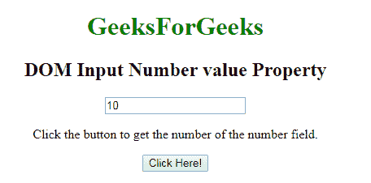
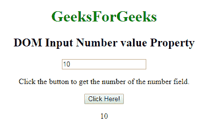
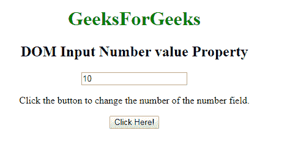
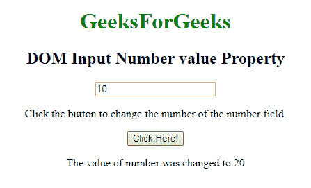

# HTML | DOM 输入数字值属性

> 原文:[https://www . geesforgeks . org/html-DOM-input-number-value-property/](https://www.geeksforgeeks.org/html-dom-input-number-value-property/)

HTML DOM 中的 **DOM 输入数字值属性**用于设置或返回数字字段的值属性的值。值属性指定输入数字字段的初始值。它包含默认值或用户类型。

**语法:**

*   它返回 value 属性。

    ```html
    numberObject.value
    ```

*   它用于设置值属性。

    ```html
    numberObject.value = number
    ```

**属性值:**包含单值**文本**，定义输入数字字段的值。

**返回值:**返回代表数字字段值的字符串值。

**示例-1:** 这个示例说明了如何**返回**属性。

```html
<!DOCTYPE html> 
<html> 

    <body style="text-align:center;"> 

        <h1 style="color:green;"> 
            GeeksForGeeks 
        </h1> 

        <h2>DOM Input Number value Property</h2> 

        <input type="number"
            id="myNumber"
            value="10"> 

        <p>Click the button to get the 
        number of the number field.</p> 

        <button onclick="myFunction()"> 
            Click Here! 
        </button> 

        <p id="demo"></p> 

        <script> 
            function myFunction() { 

                // Accessing input value 
                var x = 
                document.getElementById("myNumber").value; 
                document.getElementById("demo").innerHTML = x; 
            } 
        </script> 

    </body> 

</html> 
```

**输出:**
**点击按钮前:**

**点击按钮后:**

**示例-2 :** 本示例说明如何**设置**属性。

```html
<!DOCTYPE html> 
<html> 

    <body style="text-align:center;"> 

        <h1 style="color:green;"> 
            GeeksForGeeks 
        </h1> 

        <h2>DOM Input Number value Property</h2> 

        <input type="number"
            id="myNumber"
            value="10"> 

        <p>Click the button to change the 
        number of the number field.</p> 

        <button onclick="myFunction()"> 
            Click Here! 
        </button> 

        <p id="demo"></p> 

        <script> 
            function myFunction() { 

                // Accessing input value 
                var x = 
                document.getElementById("myNumber").valued  = "20"; 
                document.getElementById("demo").innerHTML = 
                "The value of number was changed to " + x; 
            } 
        </script> 

    </body> 

</html> 
```

**输出:**
**点击按钮前:**

**点击按钮后:**


**支持的浏览器:****DOM 输入数值属性**支持的浏览器如下:

*   谷歌 Chrome
*   Internet Explorer 10.0 +
*   火狐浏览器
*   歌剧
*   旅行队