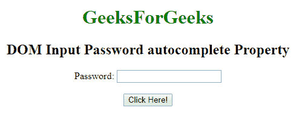
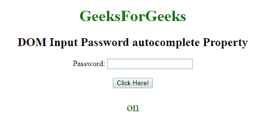
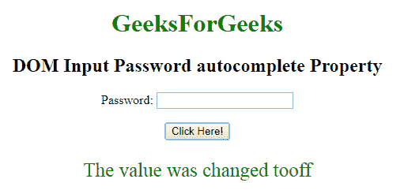

# HTML | DOM 输入密码自动完成属性

> 原文:[https://www . geesforgeks . org/html-DOM-input-password-autocomplete-property/](https://www.geeksforgeeks.org/html-dom-input-password-autocomplete-property/)

HTML DOM 中的**输入密码自动完成属性**用于设置或返回输入密码字段的自动完成属性的值。自动完成属性用于指定自动完成属性的值是“开”还是“关”。当“自动完成”属性设置为“开”时，浏览器将根据用户之前输入的值自动完成。

**语法:**

*   它返回输入密码自动完成属性。

    ```html
    PasswordObject.autocomplete
    ```

*   它用于设置输入周本地自动完成属性。

    ```html
    Password Object.autocomplete = "on|off" 
    ```

**属性值:**包含以下两个值:

*   **开:**为默认值。它会自动完成这些值。
*   **off:** 定义用户应填写 URL 输入字段的值。它不会自动完成这些值。

**返回值:**返回一个代表自动完成状态的字符串值。

**示例 1:** 本示例返回输入密码自动完成属性。

```html
<!DOCTYPE html> 
<html> 

<body style="text-align:center;"> 

    <h1 style="color:green;"> 
        GeeksForGeeks 
    </h1> 

    <h2>DOM Input Password autocomplete Property</h2>

    Password: 
    <input type="password" id="myPsw"
            autofocus> 

    <br><br> 

    <button onclick="myFunction()"> 
        Click Here! 
    </button> 

    <p id="demo" style="color:green;font-size:25px;"></p> 

    <script> 
        function myFunction() { 
            var x = 
            document.getElementById( 
            "myPsw").autofocus; 

            document.getElementById( 
            "demo").innerHTML = x; 
        } 
    </script> 
</body> 

</html> 
```

**输出:**

*   **点击按钮前:**
    
*   **点击按钮后:**
    

**示例 2:** 本示例设置输入密码自动完成属性。

```html
<!DOCTYPE html> 
<html> 

<body style="text-align:center;"> 

    <h1 style="color:green;"> 
        GeeksForGeeks 
    </h1> 

    <h2>DOM Input Password autocomplete Property</h2>

    Password: 
    <input type="password" id="myPsw"
            autocomplete="on"> 

    <br><br> 

    <button onclick="myFunction()"> 
        Click Here! 
    </button> 

    <p id="demo" style="color:green;font-size:25px;"></p> 

    <script> 
        function myFunction() { 
            var x = 
                document.getElementById( 
                "myPsw").autocomplete = "off"; 

            document.getElementById("demo").innerHTML
                 = " The value was changed to" + x; 
        } 
    </script> 
</body> 

</html> 
```

**输出:**

*   **点击按钮前:**
    
*   **点击按钮后:**
    

**支持的浏览器:**T2 DOM 输入密码自动完成属性支持的浏览器如下:

*   谷歌 Chrome
*   微软公司出品的 web 浏览器
*   火狐浏览器
*   苹果 Safari
*   歌剧