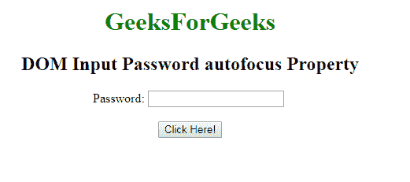
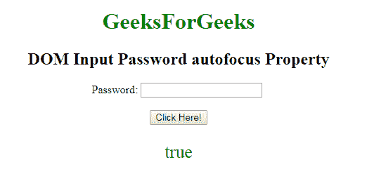
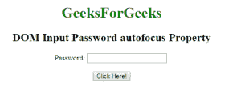
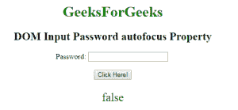

# HTML | DOM 输入密码自动对焦属性

> 原文:[https://www . geesforgeks . org/html-DOM-输入-密码-自动对焦-属性/](https://www.geeksforgeeks.org/html-dom-input-password-autofocus-property/)

**DOM 输入密码自动对焦属性**用于设置或返回页面加载时输入密码字段是否应该对焦。该属性用于反映 **HTML 自动对焦属性。**

**语法:**

*   它用于返回自动对焦属性。

    ```html
    passwordObject.autofocus
    ```

*   它用于设置自动对焦属性。

    ```html
    passwordObject.autofocus = true|false
    ```

**属性值:**

*   **真:**定义**密码字段**获得焦点。
*   **false:** It has a default value. It defines that the **Password field** does not get focus

    。

**返回值:**返回一个布尔值，表示**密码字段**是否自动对焦。

**示例-1:** 本示例说明了如何**返回**属性。

```html
<!DOCTYPE html> 
<html> 

<body style="text-align:center;"> 

    <h1 style="color:green;"> 
            GeeksForGeeks 
        </h1> 

    <h2>DOM Input Password autofocus Property</h2> Password: 
    <input type="password"
        id="myPsw"
         autofocus> 
      <br><br>
    <button onclick="myFunction()"> 
    Click Here! 
</button> 

    <p id="demo" style="color:green;font-size:25px;"></p> 

    <script> 
        function myFunction() { 
            var x = 
            document.getElementById( 
            "myPsw").autofocus; 

            document.getElementById( 
            "demo").innerHTML = x; 
        } 
    </script> 

</body> 

</html> 
```

**输出:**
**点击按钮前:**

**点击按钮后:**


**示例-2:** 本示例说明如何**设置**属性。

```html
    <!DOCTYPE html> 
<html> 

<body style="text-align:center;"> 

    <h1 style="color:green;"> 
            GeeksForGeeks 
        </h1> 

    <h2>DOM Input Password autofocus Property</h2> Password: 
    <input type="password"
        id="myPsw"
        autofocus> 
    <br><br>
    <button onclick="myFunction()"> 
    Click Here! 
</button> 

    <p id="demo" style="color:green;font-size:25px;"></p> 

    <script> 
        function myFunction() { 
            var x = 
            document.getElementById( 
            "myPsw").autofocus = false;

            document.getElementById( 
            "demo").innerHTML = x; 
        } 
    </script> 

</body> 

</html>                    
```

**输出:**

**点击按钮前:**

**点击按钮后:**


**支持的浏览器:**T2 DOM 密码自动对焦属性支持的浏览器如下:

*   谷歌 Chrome
*   微软公司出品的 web 浏览器
*   火狐浏览器
*   歌剧
*   旅行队