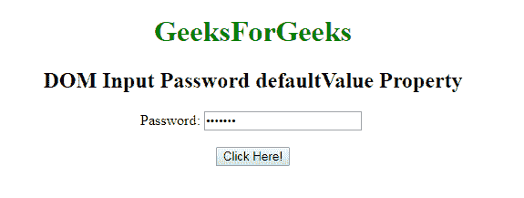
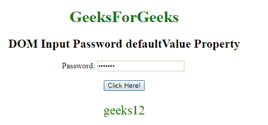
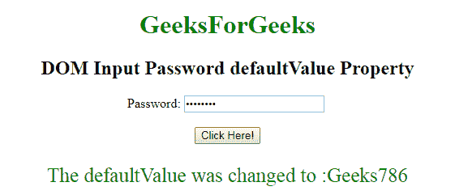

# HTML | DOM 输入密码默认值属性

> 原文:[https://www . geesforgeks . org/html-DOM-input-password-default value-property/](https://www.geeksforgeeks.org/html-dom-input-password-defaultvalue-property/)

**[DOM 输入密码](https://www.geeksforgeeks.org/html-dom-input-password-object/)默认值属性**用于设置或返回**密码字段**的默认值。该属性用于反映 **HTML 值属性**。默认值**与**的主要区别在于，默认值表示属性中指定的默认值，而该值在进行一些更改后包含**当前值**。当我们想知道密码字段是否已被更改时，此属性很有用。

**语法:**

*   它用于返回 defaultValue 属性。

    ```html
    passwordObject.defaultValue
    ```

*   它用于设置 defaultValue 属性。

    ```html
    passwordObject.defaultValue = value
    ```

**属性值:**

*   **value:** It defines the default value for a **Password Field.**

    **返回值:**返回一个代表**密码字段默认值的字符串值。**

    **示例-1** 本示例说明如何**归还**房产。

    ```html
    <!DOCTYPE html>
    <html>

    <body style="text-align:center;">

        <h1 style="color:green;"> 
                GeeksForGeeks 
            </h1>

        <h2>DOM Input Password defaultValue Property</h2> Password:
        <input type="password" id="myPsw" value="geeks12">
        <br>
        <br>
        <button onclick="myFunction()">
            Click Here!
        </button>

        <p id="demo" style="color:green;font-size:25px;"></p>

        <script>
            function myFunction() {
                var x =
                    document.getElementById(
                        "myPsw").defaultValue

                document.getElementById(
                    "demo").innerHTML = x;
            }
        </script>

    </body>

    </html>                   
    ```

    **输出:**

    *   **点击按钮前:**
        
    *   **点击按钮后:**
        

    **例-2:** 本例说明如何**设置**属性。

    ```html
    <!DOCTYPE html>
    <html>

    <body style="text-align:center;">

        <h1 style="color:green;"> 
                GeeksForGeeks 
            </h1>

        <h2>DOM Input Password defaultValue Property</h2> Password:
        <input type="password" id="myPsw" value="geeks12">
        <br>
        <br>
        <button onclick="myFunction()">
            Click Here!
        </button>

        <p id="demo" style="color:green;font-size:25px;"></p>

        <script>
            function myFunction() {
                var x =
                    document.getElementById(
                        "myPsw").defaultValue = "Geeks786"

                document.getElementById("demo")
                    .innerHTML = "The defaultValue was changed to :" + x;
            }
        </script>

    </body>

    </html>            
    ```

    **输出:**

    *   **点击按钮前:**
        
    *   **点击按钮后:**
        

    **支持的浏览器:**T2 DOM 输入密码默认值属性支持的浏览器如下:

    *   谷歌 Chrome
    *   微软公司出品的 web 浏览器
    *   火狐浏览器
    *   歌剧
    *   旅行队