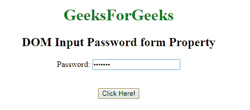
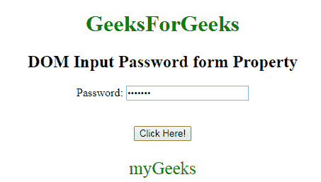

# HTML | DOM 输入密码表单属性

> 原文:[https://www . geesforgeks . org/html-DOM-input-password-form-property/](https://www.geeksforgeeks.org/html-dom-input-password-form-property/)

**DOM 输入密码表单属性**用于返回包含输入密码字段的表单的引用。它是一个只读属性，在成功时返回一个表单对象。
**语法:**

```html
passwordObject.form
```

**返回值:**它返回一个字符串值，该值指定包含输入密码字段的表单的引用

下面的程序说明了输入密码表单属性。

**示例:**返回输入密码表单属性。

## 超文本标记语言

```html
<!DOCTYPE html>
<html>

<body style="text-align:center;">

    <h1 style="color:green;">
            GeeksForGeeks
        </h1>

    <h2>DOM Input Password form Property</h2>

   <form id="myGeeks">
     Password: <input type="password"
        id="myPsw"
         value="geeks12">
         </form>
    <br><br>
    <button onclick="myFunction()">
    Click Here!
</button>

    <p id="demo" style="color:green;font-size:25px;"></p>

    <script>
        function myFunction() {
            var x =
            document.getElementById(
            "myPsw").form.id;

            document.getElementById(
            "demo").innerHTML = x;
        }
    </script>

</body>

</html>                   
```

**输出:**
**点击按钮前:**



**点击按钮后:**



**支持的浏览器:**T2 DOM 输入密码表单属性支持的浏览器如下:

*   谷歌 Chrome
*   微软公司出品的 web 浏览器
*   火狐浏览器
*   歌剧
*   旅行队